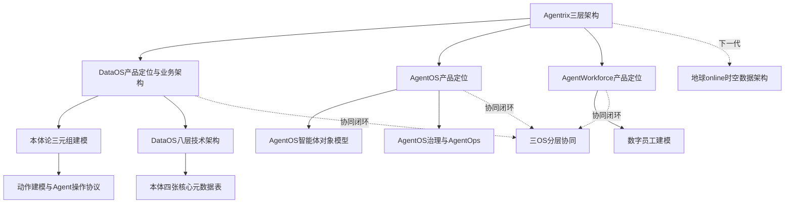
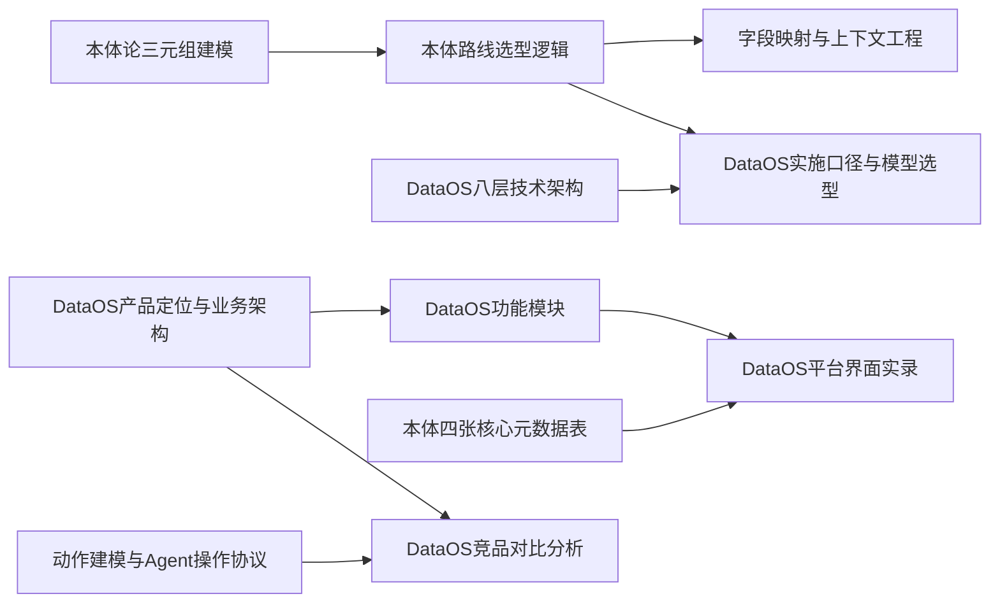
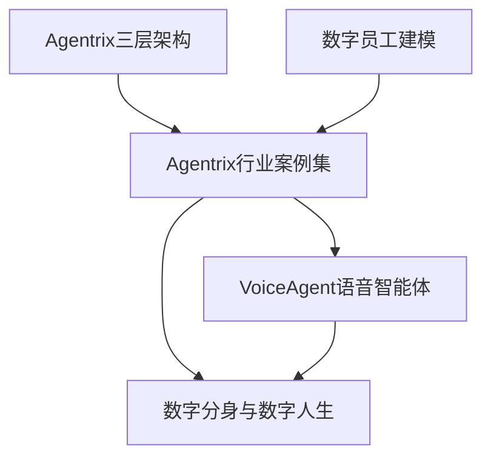
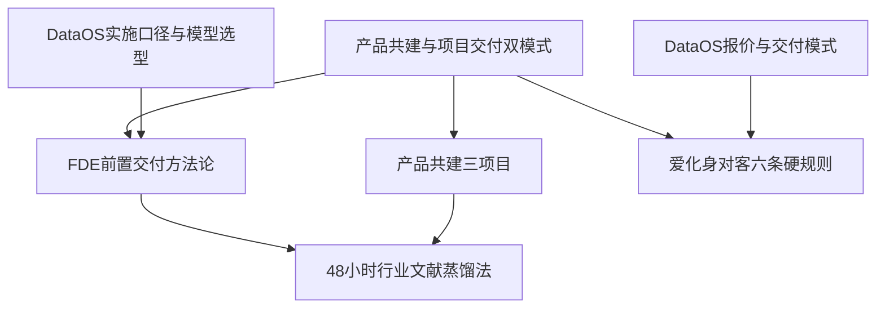
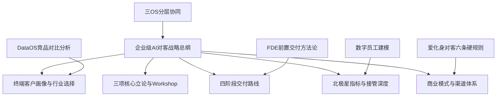

# 概念关系图谱

> 原有 35 篇主题的关系骨架，加上本轮 8 篇知识的连接。图中关联不等于独立事实验证；版本与来源状态见 [[待核实与冲突]]。

## 一、产品栈分层（核心骨架）

## 二、DataOS 技术与售前支撑体系

## 三、应用产品线与案例

## 四、商业模式与组织（服务全景线）

## 五、战略总纲（原笔记引用 2026-08，版本待核实）

## 关键洞察（原有跨笔记综合，尚未全部复核）

1. **一条主线贯穿所有资料**：从数据（[[DataOS产品定位与业务架构]]）到智能体（[[AgentOS产品定位]]）到劳动力（[[AgentWorkforce产品定位]]），再到卖法（[[企业级AI对客战略总纲]]），全部围绕"本体是企业级 AI 的认知基础"展开（[[本体路线选型逻辑]]、[[三项核心立论与Workshop]]）。
2. **对内对外两套话语体系**：白皮书对外克制（不保证性能、高风险保留人工），内部文档激进（"不做验证""AI 原生碾压甲方"）；对客时按总纲附录 A 术语表转换（[[爱化身对客六条硬规则]] vs [[企业级AI对客战略总纲]]）。
3. **方法论即壁垒**：[[48小时行业文献蒸馏法]]、[[FDE前置交付方法论]]、[[字段映射与上下文工程]] 都是"用 AI 方法交付 AI 项目"的自举——4-8 人小队替代 50 人团队的组织基础。
4. **已知短板有自知**：[[DataOS竞品对比分析]] 承认行业案例与生态弱于百度胜算（3.85 vs 4.65），与战略上聚焦"重自主可控政企客户"（[[终端客户画像与行业选择]]）互为因果。
5. **按问题判断证据**：正式发布状态、适用范围、版本与直接证据共同决定可信度。白皮书可以支持产品定位，却不能单独证明客户验收或经营收益；不要用固定文档类型排序代替核验。

## 六、本轮新增知识的连接

- [[语音智能体配置与电话业务流程]] → [[VoiceAgent语音智能体]]、[[AgentOS治理与AgentOps]]
- [[DataOS售前问答与能力边界]] → [[字段映射与上下文工程]]、[[动作建模与Agent操作协议]]
- [[北控水务污水生化调控方案]] → [[产品共建三项目]]、[[本体论三元组建模]]
- [[侨银城市服务任务闭环]] → [[数字员工建模]]、[[Agentrix行业案例集]]
- [[重庆轨道数智化方案（2026-05）]] → [[Agentrix三层架构]]、[[三OS分层协同]]
- [[差旅申请与报销规则]] → [[待核实与冲突]]
- [[对外发声与信息使用边界]] → [[爱化身对客六条硬规则]]、[[DataOS售前问答与能力边界]]
- [[AI Native组织与闭环协作]] → [[数字员工建模]]、[[LLM Wiki 使用与结构]]

以上新页均通过 [[来源索引]] 回到本次保存的原始资料。来源层、知识层与维护层的职责见 [[LLM Wiki 使用与结构]]。
