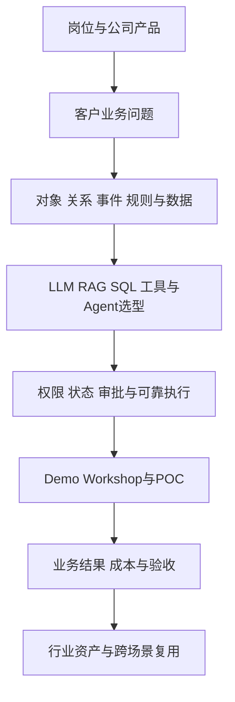

# 爱化身入职学习地图

这套知识库围绕 **AI Native售前技术专家** 的真实工作：理解客户问题，翻译成数据与业务模型，快速演示，设计POC，管理技术边界，与交付团队协同。

==2026-09-16更新：先看[[START-明天入职只看这一页|AI售前入职速学：把核心知识讲明白]]。== 这一页已重写为报销、订单、库存等通用企业案例，讲清 LLM、RAG、工具调用、本体、Agent、MCP/Skills、三层架构与 WBM 的机制，并附售前应用深度和带答案的自测。完整教材用于按实际任务继续深入。

原[[PLAN-01-五天入职冲刺]]保留作分主题练习参考，可按入职后的任务安排使用。

**入职沟通：**用[[PLAN-02-入职后30-60-90天与产品确认清单|负责人沟通与六个月试用期计划]]准备首次目标对齐，包含六组核心问题、一月／三月／六月目标草案和会后确认模板。目标须与负责人和 HR 确认。

> [!tip] 先理解你的优势与缺口
> [[CO-01-为什么录用你与岗位能力地图]]依据面试原文梳理匹配点。城市经验、真实Demo与沟通能力有证据支持；需要补的是企业数据与本体、可靠执行、售前验证和协同。录用认可不意味着必须已经精通所有理论。

## 学习主线

速学页先用报销、订单和库存建立通用 AI 与企业业务知识。深入教材保留“城市环卫发现问题→查证据→选择资源→批准→派单→复核关闭”的贯穿案例，连接你的 UrbanScope 和 To G 经验；也可选补货、客服、招聘等场景练习迁移。基础学习无需先掌握环卫行业知识。

## 1. 公司、岗位与方向

| 笔记 | 学完可以做什么 |
|---|---|
| [[CO-01-为什么录用你与岗位能力地图]] | 根据证据理解匹配点，逐条对照JD制定产出 |
| [[CO-02-Agentrix产品三层架构与能力核验]] | 讲清Data OS、Agent OS、Workforce，以及本体/WBM关系 |
| [[CO-03-CityOS方向证据与旧材料校正]] | 判断城市方向机会，区分公开事实、推测与未确认岗位安排 |

## 2. AI应用技术完整教材

| 笔记 | 核心问题 |
|---|---|
| [[AI-01-LLM原理与模型选型]] | Token、Embedding、Attention、训练/微调/RAG、模型能力与选择 |
| [[AI-02-Prompt与上下文工程]] | 指令、示例、证据、记忆、状态、上下文预算与注入边界 |
| [[AI-03-RAG从检索到可信回答]] | 解析、切块、索引、混合检索、重排、多跳、引用与故障定位 |
| [[AI-04-Function Calling与API工具设计]] | 调用流程、Schema、接口、校验、权限、审批、幂等和返回结果 |
| [[AI-05-Agent工作流MCP与Skills]] | 路径控制、状态机、单/多Agent、MCP协议与技能资产 |
| [[AI-06-评测可观测性与成本性能]] | 评测集、评分、Trace、延迟、成本、可靠性与上线反馈 |

## 3. 数据、本体与企业架构完整教材

| 笔记 | 核心问题 |
|---|---|
| [[DATA-01-数据库SQL与数据接入]] | 数据粒度、主外键、SQL、存储、批/流/CDC、事务与血缘 |
| [[DATA-02-本体建模从对象到动作]] | 对象类型与实例、实体解析、关系、事件、规则、动作、时空有效性 |
| [[DATA-03-知识图谱GraphRAG与语义层]] | 图谱、本体、SQL和检索如何配合，何时值得构图 |
| [[DATA-04-企业集成权限部署与可靠执行]] | 身份/授权、审批、幂等、并发、补偿、部署与运行责任 |
| [[DATA-05-世界行为模型与可验证决策]] | 公司WBM公开信息、预测/规划/因果边界、模拟与反馈验证 |

## 4. 售前方法与工作模板

| 完整笔记 | 可直接使用的资产 |
|---|---|
| [[PRE-01-需求诊断与高层技术沟通]] | [[TPL-01-客户访谈与业务蓝图]] |
| [[PRE-02-Demo工作坊与POC设计]] | [[TPL-02-POC章程与验收矩阵]] |
| [[PRE-03-方案商业价值与技术异议]] | [[TPL-04-客户演示脚本与技术问答]] |
| [[PRE-04-能力边界FDE协同与资产沉淀]] | [[TPL-03-能力确认与FDE交接]] |

模板包含示例和话术。复制成项目资产时替换教学假设、数字、角色和规则，不把模拟示例直接作为客户事实。

## 5. 行业与动手练习

- [[CITY-01-城市治理业务与环卫履约闭环]]：角色、合同、资源、证据、调度和验收。
- [[CITY-02-CityOS时空数据调度与多模态设计]]：GIS、时空有效性、视觉/语音、专业预测与调度、设备边界。
- [[CITY-03-跨行业方案迁移与技术选型]]：补货完整迁移，以及招聘、客服、银行、制造和医疗的差异。
- [[LAB-01-城市环卫闭环桌面演练]]：可纸上练，也可运行离线Python参考实现；附模拟数据与12项检查。
- [[LAB-02-AI Coding快速原型与排错工作法]]：用AI开发工具做最小流程，理解前后端、接口、排错与部署。

## 6. 复习与成长计划

- [[REV-01-核心概念速查与易错对照]]：按产品、AI、数据与验证快速回忆，链接回完整笔记。
- [[REV-02-入职自测题与参考答案]]：20道场景题与可展开答案，含个人错题表。
- [[PLAN-01-五天入职冲刺]]：每天60分钟必做＋60分钟可选，明确产出与完成标准。
- [[PLAN-02-入职后30-60-90天与产品确认清单|入职目标对齐与六个月试用期计划]]：负责人沟通提纲、阶段目标草案、考核确认、个人工作建议与产品核验台账。

## 7. 如何判断自己学会了

每个主题至少做到“能用自己的话解释、能套入环卫例子、能说一个反例、能提出验证办法”。解释本体时画对象和关系；解释工具调用时指出执行与权限在哪；解释POC时写验收分母。只记缩写还不能转成工作能力。

母笔记提供原理、步骤、例子、权衡、失败模式和有答案自测；复习页与模板作为入口。每次卡住先回母笔记，不新建一堆只有定义的重复卡片。

## 来源与当前边界

从[[SRC-00-来源总索引与证据边界]]查看原始文件、官网、微信读取状态与技术资料；分册来源：[[AI技术来源]]、[[数据架构来源]]、[[售前方法来源]]。

> [!warning] 三类信息不要混用
> 公司公开描述不等于本次实测能力；本文模拟方案不等于公司已交付方案；城市路线证据不等于你的岗位分配。你提供的三篇微信文章本次未取得正文，作者身份和黑客松细节仍待补证，已在CO-03保留原链接。

原件在`99-附件`。当前知识库独立于已有AI产品课程笔记，未改动原课程结构。资料适合个人入职学习，对外使用需换成公司已批准的版本与口径。
