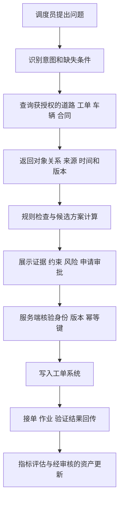

# Agentrix产品三层架构与能力核验

返回 [[00-爱化身入职学习地图]]

**P0：第1–4节和第7节，约25分钟；P1：第5–6节用于入职后产品学习。**

来源基准：公司提供的[[爱化身介绍.pdf]]第10–19页，重点15–18页；[官网首页](https://www.aihuashen.com/)核验了当前仍使用三层架构与WBM、时空本体叙事。以下“公司口径”是公开描述；“教学设计”是理解与验证的方法，不等同实际平台界面或内部实现。

## 1. 先用一个真实业务问题组织产品

客户说：“为什么昨天某条路被投诉没清扫？今天如何减少同类事件？”这不是单纯的文档问答。必须知道是哪条路、适用哪个合同、昨天谁作业、设备是否开启、投诉发生在何时、哪些数据可信；然后判断是否需要复核、生成整改建议、让有权限的人批准、跟踪结果。

三层架构围绕这条链分工：Data OS把数据组织成有业务含义的对象和证据；Agent OS组织分析、工具、步骤和控制；Workforce把能力包装成岗位可以使用、衡量和持续运营的工作单元。

“OS”在这里首先是公司产品的组织比喻与平台定位，不应直接等同Windows/Linux的内核、进程调度和设备驱动。需要讲企业能力管理，不需要向客户宣称替代现有操作系统。

## 2. 三层逐层理解

| 层 | 公司材料中的能力 | 教学中对应的问题 | 具体输出 |
|---|---|---|---|
| Data OS | 异构接入、向量和知识库、知识图谱、时序/事件、语义映射、本体、动作 | 这是什么、与谁有关、什么时候成立、依据在哪、允许做什么 | 道路对象、工单关系、合同规则、带时间与权限的数据视图 |
| Agent OS | 统一入口、调度、多Agent、工作流、MCP、Skills、监控与控制 | 为达成目标需要哪些步骤、调哪些能力、何时停下来交给人 | 查询计划、工具结果、审批等待、执行轨迹、失败恢复 |
| Agent Workforce | 岗位智能体、SOP、渠道与部署、反馈优化 | 谁用、处理哪项任务、谁负责、怎样衡量 | 督查助手、调度助手、管理分析助手及各自的操作界面与任务产出 |

**Data OS的深度。**从CSV导入车辆表只是接入。把GPS系统的device_id、资产系统的vehicle_id、工单中的车牌映射到同一车辆，是身份解析；定义“可派遣=在班、具备任务能力、当前位置有效、未占用”，是业务语义；记录更新时间、原系统记录、转换规则，是血缘；为create_work_order附加权限与前置条件，是动作治理。每项都可能单独失败，售前应能拆开验证。

**Agent OS的深度。**它不必是“一个万能主Agent”。教学上可以采用确定工作流、单Agent加工具、路由或多Agent分工。统一控制的价值在于知道任务跑到了哪一步、工具为什么失败、谁批准过什么、怎样结束循环。适配MCP也不意味着企业原系统天然已有可用API和写入权限。

**Workforce的深度。**数字员工不是给聊天机器人起个岗位名字。至少需要职责、服务对象、输入范围、允许动作、升级对象、评价指标和停止条件。一个督查助手负责生成可复核证据包，一个调度助手负责候选方案；是否合并，要看实际岗位工作流和复杂度，不以Agent数量证明先进性。

## 3. 从用户提问到结果反馈的一条端到端链

下面是教学参考架构。

1. 用户说“安排最近车辆”，先明确任务类型、道路范围、最迟到达时间；“最近”可能指直线距离、路网时间或完成当前任务后的可达时间。
2. Data OS或接入层返回对象及来源，而不是让模型猜谁可用。缺GPS或位置过期时，把数据质量问题显式暴露。
3. 规则/优化模块计算可行候选。LLM可帮助理解需求与解释结果，但不应靠语言概率判断承重、设备规格等硬约束。
4. 界面先显示方案；是否允许自动派单由场景与权限决定。教学案例默认人工确认。
5. 写操作时重新检查资源状态，防止“生成方案时空闲、执行时已占用”。网络超时后查询状态再重试，防止重复派单。
6. 业务回传形成闭环。HTTP 200只证明请求层成功，不证明司机接单，更不证明已清扫达标。

==三层的学习重点是从哪个系统取得依据、在哪一层做判断、谁承担执行责任。==

## 4. 本体、WBM与三层分别是什么关系

本体描述“业务里有哪些东西，它们之间是什么关系，有何规则和动作”。时空本体进一步强调对象随时间、空间变化的有效性。世界行为模型在公司公开叙事中面向业务行为、决策后果与反馈；它支持三层体系，不宜说成额外的“第四层产品”。

一个便于学习的拆分是：**本体提供状态和动作的语义；行为/预测模型估计行动可能造成的变化；规划与优化选择方案；Agent系统协调执行；岗位应用让人使用并负责。**这是功能理解，不是对Agentrix算法实现的断言。具体参见[[DATA-05-世界行为模型与可验证决策]]。

“有本体，所以能准确预测”缺了一整段工作：预测目标如何定义、训练数据是否有标签、因果还是相关、模型如何验证、分布变化怎样监测。本体能连接与约束数据，但不能替代气象、水动力学、路径优化、库存预测等专业模型。

## 5. 产品宣传应如何转化为验证问题

| 材料描述 | 不足以直接承诺的原因 | 应请求的证据 |
|---|---|---|
| 极低幻觉率 | 没有测试集、问题类型、分母与时间范围 | 检索正确率、答案依据率、规则命中、失败案例与版本 |
| 数据不出域 | 要逐段检查模型、OCR、Embedding、遥测、日志等外部调用 | 部署图、出站网络清单、数据流与模型端点配置 |
| 毫秒级响应 | 传感器更新、界面刷新、单次规则与完整Agent任务延迟不同 | 场景定义、并发、数据量、p50/p95/p99及硬件 |
| 自主进化 | 更新可能是知识/规则/提示词/模型，不同机制风险不同 | 更新对象、人工审核、离线评测、发布与回滚 |
| 全域数据接入 | 格式、接口、历史质量、授权和频率存在差异 | 已验证连接器列表、增量同步、删除同步、失败重放 |
| 可离线使用 | 可能只有部分界面或本地能力离线 | 断网时哪些工作可读、可写、排队和恢复 |
| 全局最优 | 需要明确目标、约束与算法保证 | 最优/近似的定义、基准、求解时间、不可行的返回机制 |
| 多智能体协作 | Agent数量多可能增加成本和失败点 | 分工必要性、协同协议、共享状态、端到端成功率 |

以上待验证项来源于PDF中的能力/价值表述，提问框架为原创。对外不应把一个经过验证的客户配置推广为所有场景都可实现。

## 6. 产品演示时最值得动手看的六项

拿到公司沙箱后：导入一张带重复记录的数据表，观察能否发现重复；建立同一对象的跨系统映射并查看证据；改变对象状态，看规则如何更新；用权限不同的账号查询同一工单；让工具超时，看任务是否可恢复；修改规则版本，查看是否可回滚。这六项能帮助你理解平台的实际边界，胜过只记功能菜单。

每项保留“版本、账号角色、输入、步骤、输出、日志或截图、限制、产品确认人”。未拿到账号时只做教学练习，不在笔记中编造“已使用Data OS完成”的记录。

行业术语也应核验：材料的“聚源类”“OAG”“世界行为模型”等可能具有公司特定含义。询问研发的产品术语表，不把市场叙事直接套成唯一学术定义。公司PDF里本体六层的药品示例，是理解方法的案例，不代表所有行业必须有同样六个业务域。

## 7. 可以直接练习的产品讲解

**30秒版：**“企业已有很多数据和软件，但AI常常不知道它们说的是同一件事，也不知道能做哪些操作。Agentrix用Data OS把业务对象、数据和规则组织起来，用Agent OS协调分析和执行，再把这些能力做成不同岗位能使用的数字员工。我们会从一个可验证场景开始，把效果、权限和交付边界说清楚。”

**2分钟版：**先提出“投诉道路是否清扫、该如何整改”，接着用道路—合同—作业—资源说明Data OS；用“查证据、算候选、申请审批、派单、验收”说明Agent OS；用“督查员、调度员、管理者分别看到什么”说明Workforce。最后解释目前演示用了哪些真实/模拟数据，哪一步已有产品验证，哪些依赖客户接口。避免一次背完所有功能名。

**自测：**Data OS把表导进来了为何仍不能派单？因为还缺身份关系、有效规则、可用资源、写API、鉴权和业务验收。多Agent都说同一个答案为何不代表可靠？它们可能共享错误数据、相同模型偏差和同一错误规则。怎样体现平台价值？用多个岗位共享的语义、权限和审计能力减少重复搭建，并通过实际项目测量，而不是只比聊天体验。
