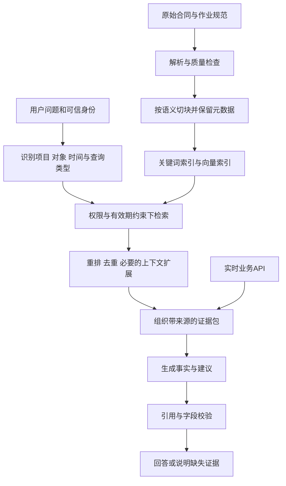

# AI-03｜RAG：从检索到可信回答

[[00-爱化身入职学习地图]] · 前置：[[AI-01-LLM原理与模型选型]]、[[AI-02-Prompt与上下文工程]]

> [!abstract] 五天内怎么读
> **P0：第 1、2、5、7、9 节，约 20 分钟。**先会画链路、区分文档知识与实时数据、解释引用和权限，再做小练习。第 3、4、6、8 节为 **P1**，作为 POC 调试手册。不要一开始就背向量数据库参数。

> [!info] 与爱化身的关系
> 公司介绍第 15—16 页展示了 Data OS 中的向量存储、业务数据、知识图谱和本体能力。本篇是对应这些概念的通用工程教材，**不是对 Agentrix 实际检索算法、数据库或默认参数的披露**。所有场景数据为教学假设。

## 1. P0：RAG 究竟解决什么问题

RAG（Retrieval-Augmented Generation，检索增强生成）让生成过程使用检索得到的外部信息。经典研究把参数化模型与外部文档检索结合；今天工程上常说的 RAG 范围更广，不要求完整复现原论文的联合训练方式。[RAG 原论文](https://arxiv.org/abs/2005.11401)

它最直接的价值是：企业知识更新时可以更新知识源与索引；回答能带依据；企业私有文档不必全部变成模型参数记忆。但它**不自动保证事实正确**：检索可能漏掉关键条款、命中过期版本、跨越权限、切断表格条件，模型也可能误读已取回的内容。

环卫客户问“下雨还需要洒水吗”，至少有三个层次：某项目现行作业规范怎么规定，今天该区域实际天气如何，现在已经安排了哪些作业。第一项适合文档 RAG；第二、三项应查询有时间戳的天气和业务系统。只查一本知识库，无法完整回答“今天该怎么办”。

因此，一个更可交付的问题定义是：“依据项目 P-01 当前有效作业规则，结合 10:00 的气象观测和现有计划，列出需要调度员复核的任务，并标注证据。”这里明确了对象、时点、事实来源和输出边界。

## 2. P0：先会画两条数据流



离线链路维护“有什么材料、如何检索”；在线链路处理“这个人此刻可以基于哪些材料回答什么”。**索引不是唯一事实源**：源系统版本变了，索引还没更新，就存在同步延迟；删除和权限撤回也需要传播到索引与缓存。

一条片段至少应有这样的教学元数据：

```json
{
  "chunk_id": "contract-P01-v3-c12-02",
  "source_id": "contract-P01",
  "version": "v3",
  "project_id": "P-01",
  "document_title": "P-01 作业规范（教学）",
  "section": "第十二条 雨天作业",
  "page": 8,
  "effective_from": "2026-09-01",
  "effective_to": null,
  "ingested_at": "2026-09-10T08:00:00+08:00",
  "acl_ref": "policy-project-P01",
  "content": "教学条款：达到指定雨量条件时，暂停常规洒水，特殊任务另行审批。"
}
```

`ingested_at` 是进入系统的时间，不是规则生效时间；`acl_ref` 是关联权限策略的线索，不是让模型自行批准访问。维护权限的权威信息仍应在可信系统中。

## 3. P1：解析和切块为什么经常比换模型更有效

PDF 解析可能把两栏文字交叉排列，把表格单位和数值拆开，或者遗漏图片中的例外说明。若“常规道路每日两次；学校周边另见附录”只保留前半句，后续检索再精准也会给出错误规则。因此要抽查原文与解析结果，特别是表格、脚注、扫描页、跨页条款和生效条件。

切块的目标是让一个检索单元包含可解释的语义，不是追求某个通用字符数。块太小会丢失适用条件；太大可能混合多种主题，检索到的噪声增加。可以从标题、段落、条款、表格行组切分开始，再根据评测调大小。对表格，保留表名、列头、单位和行对象；对于跨页条款，可保存父段 ID，命中子块后回取完整条款。

Overlap（重叠）能缓解边界断裂，但太多重叠会让前几个结果全是同一段的近重复内容，挤掉真正不同的证据。应配合去重、多样性与父子块策略测试，不能只增加重叠比例。

文档更新时可用内容哈希识别变化片段，重建相关索引；但不能只看文本哈希，因为生效日期和权限变化也应触发更新。删除后要处理旧片段、向量、搜索缓存、回答缓存和历史可见性策略。更新成功必须可检查，不能仅以“上传成功”代表知识可用。

## 4. P1：向量、关键词、重排各擅长什么

向量检索通过 Embedding 表达语义。问题“这一带的路面还脏”可能与“道路保洁不达标”相近，帮助跨措辞检索；双编码器方法可以分别编码问题和片段，再计算相似度。[Dense Passage Retrieval 原论文](https://arxiv.org/abs/2004.04906)

常见余弦相似度为：

$$sim(q,d)=\frac{q\cdot d}{\|q\|\|d\|}$$

它衡量向量方向相近程度，**不是事实置信度，也不是答案正确概率**。不同 Embedding 模型、距离定义、文本分布和索引方式下，分数不可随意横向比较。“相似度 0.8 就保证准确”没有普遍依据。

关键词检索擅长精确词项，例如道路编号、合同编号、设备型号；BM25 一类方法通过词项频率、稀有程度与长度归一化排序。向量擅长语义近义表达，两者可做混合检索。由于分数尺度不同，不能未校准就简单相加。可以用排序融合，或在任务数据上校准分数后加权。

重排（Rerank）是对初步候选再次评分。例如初步检索 30 条，再选 5 条给模型，这只是可测试起点，**不是推荐的固定生产参数**。常见 Cross-encoder 把“问题+候选片段”一起看，能更细致判断相关性，但增加计算。重排不能补救从未召回的正确条款；若正确答案根本没进入候选集，先调召回与解析。

向量索引还涉及精确搜索与近似最近邻（ANN）权衡。ANN 用速度和内存换取近似召回，配置需要在实际数据规模上测。权限/属性过滤与 ANN 的组合可能导致返回数量不足，应验证过滤执行方式、候选规模和索引支持，而不是将过滤遗漏解释成“知识不存在”。[pgvector 官方项目文档](https://github.com/pgvector/pgvector)

## 5. P0：RAG、SQL、知识图谱、本体，怎样搭配

| 客户问题 | 更合适的主要数据访问方式 | 关键原因 |
|---|---|---|
| 这份合同怎样定义达标清扫 | 文档检索 | 需要找解释性条款与引用 |
| 今天 10 点仍未完成的工单有几单 | 受控 SQL/API 聚合 | 精确计数、时点和状态很重要 |
| 哪些班组负责这条道路，相应合同是什么 | 对象关系查询/关系库 JOIN/图查询 | 需要可靠实体连接与业务关系 |
| 全市投诉集中反映了什么共性问题 | 聚类、统计、分层汇总，必要时图增强检索 | 需要跨大量材料聚合，单次 top-k 容易偏样本 |
| 给未达标路段补派任务 | 检索规则 + 实时查询 + 动作 API | 包含事实、约束和执行三个环节 |

**本体**用于定义业务对象、关系、状态、动作和约束的语义；**知识图谱**通常保存实体及其关系等实例知识；**向量索引**提供一种相似性检索路径。它们可组合，也可在不同底层数据库上实现，不能通过词语直接推断某个产品一定采用 RDF、图数据库或某种 GraphRAG。

“RAG 无法多跳”是错误说法。RAG 可以分解查询并多轮检索，例如先查道路所属项目，再查该项目合同，最后查合同的雨天条款。图结构也能帮助沿已知关系导航，但关系必须正确、完整、及时。普通 SQL JOIN 也能完成许多明确的多表关系查询，不必为了多跳而必建图数据库。

Microsoft 的 GraphRAG 研究针对跨文档的全局总结，使用图结构和社区级摘要等方法；这是具体研究方案，不是“所有 GraphRAG”的唯一定义，更不能等同于 Agentrix 本体实现。[GraphRAG 原论文](https://arxiv.org/abs/2404.16130)

售前应说：“我们先分析问题需要哪种证据和关系，再组合访问方式。”不要说“有本体以后就没有幻觉”。错误实体关联会让图上的推理看起来更完整，却把错误传播得更远。

## 6. P1：从“有引用”到“引用真的支持结论”

引用至少通过三层检查：源文档是否真实存在；引用位置是否包含相关内容；内容是否支持当前结论且适用于这个项目和时间。模型引用了雨天条款，却据此断言“所有车辆都已停工”，属于从规范跳到了现场事实，证据并不支持。

给每个关键断言附带 evidence_id，让应用检查引用 ID 属于本次允许的证据集合；之后还需要人工或评测器判断支持关系。仅校验 ID 有效不能防止误引。对冲突证据要展示冲突，不以模型语气最肯定的一条为准。

“没有检索到”应转换成“当前可访问的数据里未找到足够证据”，而不是“没有相关规定”。有效降级可以包括：扩大在授权范围内的查询、请求补充项目或时间、给出找到的部分事实、转人工查源。是否继续检索由预算与收益决定，不应无限循环。

## 7. P0：按链路定位问题，避免只改 Prompt

| 观察到的现象 | 先检查 | 优先修复 |
|---|---|---|
| 正确条款在源文件里，搜索不到 | 解析与索引是否包含完整内容 | 修 OCR/解析/切块或同步 |
| 能搜到同义词，却搜不到编号 | 关键词索引、精确字段和分词 | 加精确查询或混合检索 |
| 正确文档被排在第 40 条 | 初检召回与重排分别测试 | 调候选与重排，而不是延长答案 |
| 回答用了失效合同 | 项目、生效日期、优先级过滤 | 修版本治理 |
| 对方项目的数据进入回答 | 鉴权、检索、缓存隔离 | 修服务器权限链路并回归 |
| 证据正确却编造完成状态 | 生成指令与语义映射 | 明确状态、检验证据支持 |
| 统计数量有误 | 是否把抽样片段当全量 | 改为结构化聚合查询 |

最有效的演示往往包括一个受控失败案例：删除必要条款，系统明确说明证据不足。这样验证的是可信边界，不能把“不知道”都算成产品失败。与此同时，也要防止过度拒答；正确材料存在时，系统应能找到并回答。

## 8. P1：评测怎么分层

检索层可衡量 `Recall@k = 前 k 个结果包含的相关证据数 / 标注相关证据总数`，前提是你真的标注了相关证据集合。只需一个支持片段的任务还可测 Hit@k：至少命中一个正确片段的问题占比。需要两条联合证据时，命中其中一条不等于任务证据完整。

生成层分别测事实正确性、证据支持率、引用正确性、关键条件覆盖和合理拒答。端到端层测客户是否能据此完成任务。离线评测集应包括可回答、不可回答、多文档、版本冲突、同名对象、过期数据和权限差异，不要只放知识库里原句复制的问题。

例如 20 个测试问题中 18 个找到了证据，但只有 14 个答案满足全部条件，不能直接报告“准确率 90%”。应报告检索命中 18/20、端到端合格 14/20，以及剩余失败类别。完整评测见 [[AI-06-评测可观测性与成本性能]]。

## 9. P0：30 秒客户解释、练习与自测

**30 秒解释：**“RAG 让 AI 回答前先查您认可的资料，并给出来源。我们会治理文档版本、权限和适用范围，也会把实时业务数据通过接口查回来。判断效果时，既看找没找到正确证据，也看答案是否忠实于证据；缺证据时会说明，而不补编结论。”

**20 分钟练习：**创建三个虚构片段：A“P-01 v2：常规洒水每日两次，8 月失效”；B“P-01 v3：达到雨量条件时暂停常规洒水，9 月生效”；C“P-02 v3：某特殊清洗任务另行审批”。分别问：①P-01 今天适用什么；②今天是否真的下雨；③P-01 用户能否看 P-02。写出应使用的证据、缺失证据和服务器过滤条件。答案：①B；②需天气 API 与时间戳，B 不证明今天下雨；③依据可信授权策略，不能由相似度或用户自报权限决定。

**自测 1：**“给回答加了引用就可靠吗？” **答案：**还要核对来源真实、内容支持、版本和范围适用。

**自测 2：**“多个系统关联只能靠 GraphRAG 吗？” **答案：**不是。先定义对象与关系，关系库 JOIN、API 编排、图查询和多轮检索都有适用场景。

**自测 3：**“为什么向量搜到了‘清扫车’，仍不能把它当‘洒水车’派遣？” **答案：**语义相似不等于实体身份或作业资质，需主数据与业务规则校验。

继续：[[AI-04-Function Calling与API工具设计]]。来源：[[AI技术来源]]。
