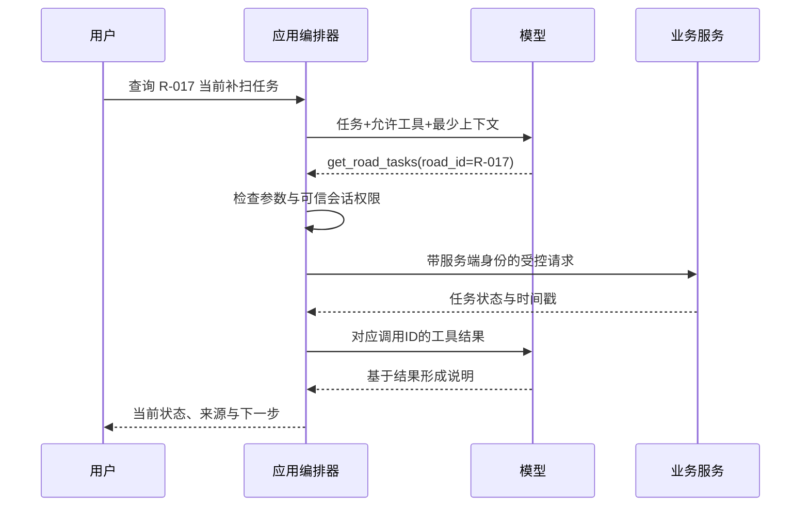

# AI-04｜Function Calling 与 API 工具设计

[[00-爱化身入职学习地图]] · 前置：[[AI-03-RAG从检索到可信回答]]

> [!abstract] 五天内怎么读
> **P0：第 1—4、7、9 节，约 20 分钟。**能解释完整工具往返、读写区别、服务端权限与重复派单问题即可。第 5—6、8 节为 **P1**，用来审查 Demo 到 POC 的工程缺口。

> [!info] 示例性质
> 本篇所有 API、工具名、道路和工单都是**通用教学设计**，不是 Agentrix 的真实接口。正式集成必须以公司当前产品 API、鉴权机制与权限模型为准。

## 1. P0：模型发起的是调用请求，真正动作由运行时执行

Function Calling / Tool Use 指模型根据任务和工具描述，生成结构化的工具名称与参数。对于应用自定义工具，运行时接收请求、校验、执行代码，再把结果交回模型。厂商托管工具可能由服务方执行；无论哪种形态，都要区分模型决策与实际执行位置。[工具调用官方文档](https://platform.claude.com/docs/en/agents-and-tools/tool-use/overview)



只看到模型输出 `create_task(...)`，不能说“系统已经派单”。必须拿到执行结果，并区分请求已接收、已创建、已派发、已接单、作业完成和验收通过。自然语言“已处理”太含糊，业务状态要明确定义。

这也是公司“洞察到执行”叙述落地时必须回答的问题：动作写回哪个系统、谁授权、如何确认、失败怎样处理、日志能否追溯。一个聊天窗口能返回 JSON，只证明了链路的一部分。

## 2. P0：工具是面向任务的接口，不是随意开放整个数据库

对模型暴露一个 `run_sql(sql)` 或 `request_any_url(url)` 看起来很灵活，却让模型承担大量隐藏规则，并扩大可访问范围。售前 POC 可优先设计受控业务工具，例如“查询道路任务”“计算候选车辆”“形成派单草案”。通用 SQL 或网络工具不是绝对不能用，但需要更严格的只读角色、语句控制、网络范围与执行隔离。

好工具应说明目的、适用时机、输入语义、返回状态和不能做什么。参数尽量用稳定 ID、明确单位与时区，避免 `name`、`time`、`data` 等无法判断语义的字段。工具太多、功能重叠，会让选择更困难；按任务封装有时比暴露几十个底层接口更有效。[工具设计官方工程文章](https://www.anthropic.com/engineering/writing-tools-for-agents)

以下是厂商无关的教学 Schema；不同平台需映射到其字段形式：

```json
{
  "name": "get_road_tasks",
  "description": "只读查询一条道路在指定时间区间的任务，不创建或修改任务。road_id 必须来自已授权道路查询结果；时间包含时区。",
  "input_schema": {
    "type": "object",
    "properties": {
      "road_id": {"type": "string", "description": "道路唯一ID，例如 R-017"},
      "start_at": {"type": "string", "description": "包含时区的开始时间，含边界"},
      "end_at": {"type": "string", "description": "包含时区的结束时间，不含边界"},
      "status": {"type": "string", "enum": ["all", "pending", "accepted", "completed"]}
    },
    "required": ["road_id", "start_at", "end_at", "status"],
    "additionalProperties": false
  }
}
```

不要让模型提供 `is_admin` 或任意 `tenant_id` 来决定权限。道路 ID 即使格式正确，也要在服务端验证属于用户可访问项目；模型从用户输入中抽取的 ID 同样不是可信授权证据。名称含“只读”或 Schema 描述“只读”，也不意味着实现真的只读，需要工具代码与后端权限保证。

## 3. P0：四层校验，解释“结构化不等于真实”

第一层是**格式校验**：字段类型、必填项、枚举、时间可解析。第二层是**对象校验**：道路和车辆是否真实存在，是否属于目标项目。第三层是**权限校验**：当前可信身份能否读这个对象、执行这个动作。第四层是**业务校验**：车辆可用吗、任务重复吗、人员在岗吗、当前状态允许转换吗。

这是概念分层，不是要求先向任何人公开对象是否存在。实现中应先取得可信身份并限定可访问范围，在授权范围内查对象；对外错误信息也应避免泄露未授权项目的存在性。检查与写入还须由服务端保证并发一致性。

结构化输出或严格工具参数能力主要减少第一层错误，不负责证明后三层。各厂商支持的 JSON Schema 子集及异常行为不同，仍需在应用校验完整业务约束，并处理拒答与截断。[结构化输出官方文档](https://platform.claude.com/docs/en/build-with-claude/structured-outputs)

教学例子：`{"vehicle_id":"V-008","road_id":"R-017"}` 完全符合字段格式，但 V-008 可能是维修中的洒水车，而任务需要清扫。若为了 Demo 顺利就让 API 永远返回成功，会把最关键的业务验证能力隐藏掉。一个可信 Demo 应展示至少一个被正确拦截的动作。

## 4. P0：读、建议、写，要按风险设计不同路径

读取已授权的数据通常可以自动执行；形成调度草案也可以自动完成。修改任务或控制设备则应依据客户政策、动作影响和已有授权配置审批，不能把所有动作都一律弹窗，也不能默认全自动。

教学 POC 可采用三工具结构：

| 工具 | 行为 | 权限和结果 |
|---|---|---|
| `get_dispatch_context` | 读取道路、任务、候选资源和规则 | 服务器过滤；返回观测时间和版本 |
| `prepare_dispatch` | 校验条件并生成派单草案 | 返回 proposal_id、预计影响、有效期和版本 |
| `commit_dispatch` | 执行已授权的具体草案 | 后端验证审批与最新状态，返回真实工单 ID |

确认界面应展示道路、车型、班组、任务时间、覆盖范围和影响，不能只写“是否继续”。确认记录要绑定具体草案和关键参数，后续改变车辆或道路后应重新校验，不能复用之前的确认。审批凭证应由可信服务生成、验证、控制有效期，不能让模型在文字里宣称“用户已批准”就生效。

“执行时再检查一次”很重要：10:00 生成草案时车辆空闲，10:01 可能被另一个调度员分配。应通过版本号、条件更新、事务锁或业务服务提供的并发机制防止竞态。前端刚查过一次状态，并不保证提交时状态仍一致。

## 5. P1：超时、重试、幂等，是从 Demo 走向交付的分水岭

**幂等**在这里指同一个业务请求被重复提交，不应产生额外业务副作用。派单 API 超时可能表示“服务没收到”，也可能表示“任务已创建，但回包丢了”。盲目重试会把一单变两单。

可由应用为一次确定的提交生成稳定 `idempotency_key`。服务器将它与请求摘要和结果关联；同 key、同参数再次到达时返回同一结果；同 key、不同参数应拒绝。仅在进程内用一个字典去重不足以应对服务重启或多实例并发；可靠实现依赖持久记录、唯一约束及业务事务设计。

如果要跨系统派发，数据库事务无法自动覆盖远端 HTTP 的副作用。可通过持久任务队列、outbox、下游幂等和对账实现最终闭环，但具体取决于目标系统能力。外部系统不支持幂等或查询时，超时后应该进入“结果待核实”，而不是自动宣称失败或无限重试。

```text
教学提交顺序（非可直接运行代码）：
1. 从可信会话取得 actor；校验动作权限。
2. 读取 proposal；核验参数摘要、有效期和审批绑定。
3. 查询 idempotency_key：若已成功，返回原结果。
4. 原子检查资源版本、业务约束与重复任务条件。
5. 持久记录提交意图，再通过可恢复机制调用业务系统。
6. 保存回执；必要时查询外部任务状态完成对账。
7. 返回 created / pending_verification / failed 等明确状态。
```

这里的步骤 4—6 需要研发依据业务系统设计事务边界，不能把这份流程图当成已实现的“恰好一次执行”保证。售前要能指出难点并拉上负责集成的人，而不是自行承诺所有历史系统都支持。

## 6. P1：工具结果也需要为模型设计

返回结果不能只有一句 `success`。建议包含业务状态、对象 ID、时间戳、数据版本、错误类型和可行下一步。把“没有数据”“没有权限”“数据过期”“依赖系统不可用”都转成空数组，会让模型错误推断“没有任务”。同时，错误详情不能泄露敏感对象或内部密钥。

```json
{
  "request_id": "req-demo-204",
  "status": "pending_verification",
  "operation": "dispatch_commit",
  "proposal_id": "proposal-09",
  "task_id": null,
  "observed_at": "2026-09-10T10:02:00+08:00",
  "error": {
    "code": "UPSTREAM_TIMEOUT",
    "message": "上游结果尚未核实；请按原请求查询状态。",
    "retry_mode": "query_status_first"
  }
}
```

对于查询，返回必要字段、摘要和分页信息，避免一次把几万条 GPS 轨迹放进模型。聚合应尽可能在数据库/计算服务完成，再让模型解释。并行调用适合彼此独立的只读查询；需要先知道 road_id 才能查所属项目，或两个写操作争用同一辆车，就不宜随意并行。

## 7. P0：失败定位对照表

| 症状 | 判断切入点 | 应对方式 |
|---|---|---|
| 模型根本没调用查询工具 | 是否清楚触发条件，工具是否可见 | 改描述/路由，必要时程序明确要求查询 |
| 调错相近工具 | 功能命名是否重叠 | 合并或清楚划分工具职责 |
| 参数正确但读到其他项目 | 服务器身份与对象权限 | 修鉴权和隔离，不只改 Prompt |
| 返回 200 但没生成真实工单 | HTTP 与业务状态混淆 | 检查业务码、异步任务和回执 |
| 刷新界面后出现两单 | 提交去重与恢复机制 | 稳定幂等键、持久状态、下游对账 |
| 用户说“取消”后仍继续派单 | 任务取消与提交状态未同步 | 定义可取消边界，执行前再次检查 |
| 模型宣称完成，业务端仅接单 | 返回状态和生成口径 | 修状态映射及成功判定 |

所有关键调用应携带 task_id/request_id 便于串联日志。需要留的是参数摘要、审批关联、实际工具结果和状态变化；不要以模型长篇解释替代执行审计。详见 [[AI-06-评测可观测性与成本性能]]。

## 8. P1：如何把工具设计变成售前评审材料

用一页表明确工具名称、输入来源、输出、是否有副作用、授权主体、超时策略、幂等能力、是否可撤销和负责人。客户系统没开放 API 时，先评估数据库视图、文件交换或人工导入等合法接入方式；界面自动化/RPA 可以作为选择，但界面改动、验证码与账号权限会影响稳定性，不能把它包装成与稳定 API 同等可靠。

做轻量 Demo 时允许 mock，但界面和讲解应明确“这一步是模拟调用”。POC 则要选定至少一个关键真实接口验证时延、权限和异常。只有正常路径能跑通，尚不能证明全天候可靠执行。

## 9. P0：30 秒客户解释、练习与自测

**30 秒解释：**“工具调用让 AI 从回答问题走向调用业务系统。模型提出调用和参数，后端核验身份、对象与业务规则，再执行并返回真实结果。对于派单，我们会处理审批、资源冲突和重复提交；看到‘已接单’只说已接单，完成要等完成证据。”

**20 分钟练习：**为 `prepare_dispatch` 写四个字段及语义，再写五种返回：成功草案、车辆维修、跨项目无权访问、道路不明确、数据过期。接着口头演示“提交超时”应怎样处理。参考：道路 ID、任务类型、计划开始时间、依据任务 ID；超时应保留原请求标识先查询结果，不能立即新建另一请求。

**自测 1：**“模型能调用工具，是否说明它有权限？” **答案：**不是。可见工具只是能力入口，权限由服务端对可信身份与对象执行验证。

**自测 2：**“重试时生成新幂等键可以避免重复吗？” **答案：**不行。同一逻辑提交应复用原键，换新键会被视为新操作。

**自测 3：**“读工具是否永远没有风险？” **答案：**不是。可能返回敏感信息、消耗大量资源，甚至实现中存在隐含副作用；需要验证接口行为与访问范围。

继续：[[AI-05-Agent工作流MCP与Skills]]。来源：[[AI技术来源]]。
