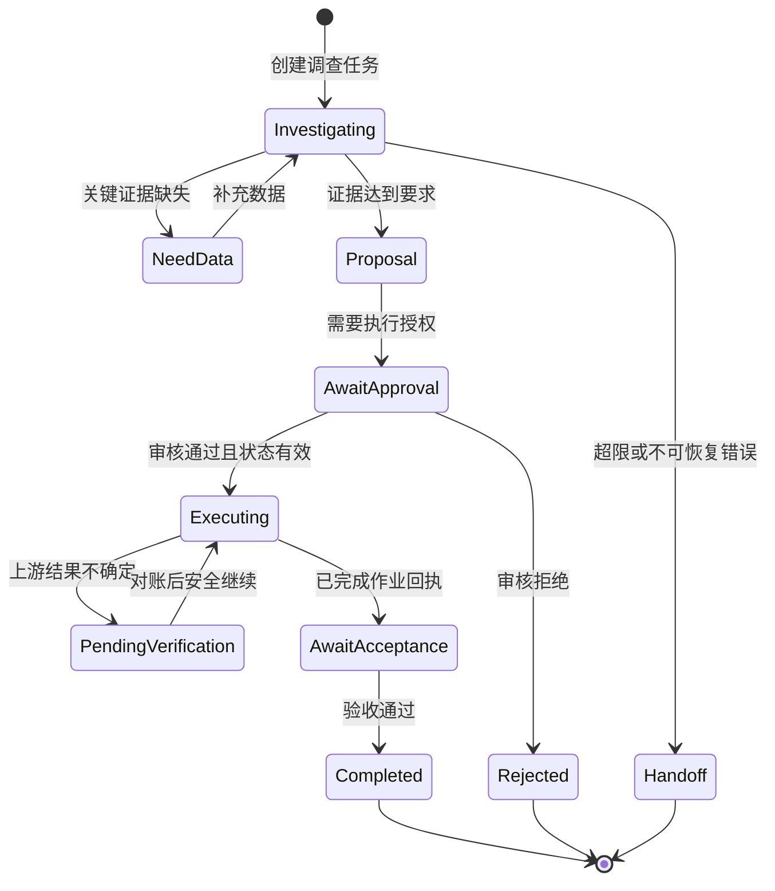

# AI-05｜Agent、工作流、MCP 与 Skills

[[00-爱化身入职学习地图]] · 前置：[[AI-04-Function Calling与API工具设计]]

> [!tip] 五天内怎么读
> **P0：第 1—4、6、8 节，约 20 分钟。**能区分“谁决定下一步、怎样接系统、怎样复用 SOP”，并画出带人工节点的任务闭环。第 5、7 节为 **P1**。

> [!tip] 版本与产品边界
> MCP 细节明确以 **2025-11-25 规范版本**解释，不声称它是阅读时的最新版本；实施时检查客户端、服务端协商版本及支持能力。Skills 参考开放 Agent Skills 规范。公司介绍提到 MCP、Skill、多 Agent，不足以证明 Agentrix 已支持规范中每个可选功能。

## 1. P0：用“谁决定下一步”区分工作流和 Agent

工作流的主要执行路径由预定义代码或流程图决定；其中可以有 LLM 节点。Agent 通常让模型在目标与约束下，根据环境返回的信息决定下一步工具和行动。实际产品常是混合结构，不必为“到底算不算 Agent”争论：真正重要的是每一段决策自由度、可干预点与责任边界。[Building Effective Agents](https://www.anthropic.com/engineering/building-effective-agents)

客户说“每晚汇总当日未完成工单，发给调度主管”，步骤比较稳定：定时查询→按规则过滤→生成摘要→必要审核→投递。适合工作流。客户说“查清 R-017 为什么连续被投诉，并形成证据充分的建议”，需要根据线索选择查合同、轨迹、设备故障或投诉，步骤不完全可预知，适合在限定工具范围内使用 Agent。

二者可以结合：Agent 负责调查和解释；固定工作流负责审批、派单和回执。不能因为任务叫“智能体”就让所有节点都自由决策；也不必为了可控而完全放弃动态调查能力。

## 2. P0：一个 Agent 至少包含哪些真实部件

| 部件 | 作用 | 环卫例子 |
|---|---|---|
| 目标与完成条件 | 知道何时停止，什么算成功 | 找齐证据并形成可审核补扫建议 |
| 模型与任务指令 | 选择下一步、解释证据 | 判断需补查车辆轨迹 |
| 工具 | 访问数据和执行动作 | 查工单、查规则、生成草案 |
| 状态/记忆 | 保存进度、证据和待办 | 哪些线索已排除，哪些查询未完成 |
| 编排运行时 | 实际调工具、处理循环、恢复 | 校验参数、限步、重试、暂停 |
| 权限与规则 | 限定数据和动作范围 | 只能看本项目，派单受业务授权 |
| 评测和观测 | 判断可靠性、定位失败 | 追踪证据、调用和最终业务状态 |

常见的循环是“观察→提出下一步→调用工具→读取结果→更新状态”，直到满足完成条件、需要人工输入或触发预算/错误限制。ReAct 研究展示了语言推理与环境行动交替的方式；它是理解这种循环的经典参考，不代表部署必须暴露模型完整内在推理。[ReAct 原论文](https://arxiv.org/abs/2210.03629)

```text
教学循环（不绑定任何框架）：
读取任务状态和最新证据
若目标已满足：输出结果并结束
若关键资料缺失且无法自动取得：请求补充并暂停
若步数/时间/费用超限：保存进度，交接人工
模型提出允许范围内的下一步
运行时校验工具、参数、权限和业务前置条件
执行工具，保存真实结果与错误
更新任务状态，进入下一轮
```

“能自动多做几步”只说明自治程度，不说明业务效果更好。一个循环十次仍没有查到有效证据的 Agent，可能不如一条正确的数据库查询。

## 3. P0：用状态机把任务变成可管理的业务过程



这是教学流程，可按实际业务删减。关键不是节点多，而是状态含义清楚：技术运行“模型已输出”不能代替业务“补扫已验收”。`task_runtime_state` 与 `work_order_state` 最好分别记录，否则很容易把 Agent 回答结束误报成现场任务完成。

持久化要保存任务 ID、当前节点、关键证据、实际动作与回执。恢复时先读取业务系统状态，不能因为聊天记录里有一句“已经派单”就认定动作成功。取消也有边界：草案阶段可以取消；已经下发到现场的任务，可能需要另一个撤销流程和回执。

公司介绍中的“可干预、Trace、状态机、全周期管控”可用这些具体问题验证：能否从审核节点恢复？超时后状态是否可见？谁能终止任务？已执行动作如何回溯？未看到产品前，将它们记为验证问题，不当作已证明能力。

## 4. P0：MCP 解决接入协议问题，不替你完成业务集成

MCP（Model Context Protocol）提供模型应用与外部能力交换的协议。在固定参考版本中采用 Host—Client—Server 结构：Host 是承载 AI 功能的应用，负责上下文与连接管理；Client 管理和某个 Server 的协议连接；Server 暴露工具、资源和提示模板等能力。[MCP 架构规范 2025-11-25](https://modelcontextprotocol.io/specification/2025-11-25/architecture)

比如 Agentrix 的某个运行入口作为 Host，通过 MCP Client 连接“环卫系统适配服务”；后者把企业原有 API 封装成 MCP Tools。这是**可供讨论的架构示例**，不是现有产品实现证明。

| 概念 | 核心问题 | 环卫例子 |
|---|---|---|
| API | 外部系统怎样提供能力 | 业务系统的查询工单接口 |
| Function Calling | 模型怎样表达调用选择与参数 | 生成 get_road_tasks 参数 |
| MCP | AI 应用怎样标准化发现/调用外部能力 | 列出工具、读取工具 Schema、发起调用 |
| Workflow | 谁规定主要执行路径 | 固定“查询→审核→派单”流程 |
| Skill | 怎样封装可复用的任务方法 | 环卫投诉调查 SOP 与报告模板 |
| Agent | 谁根据环境反馈决定下一步 | 判断还需查哪类证据 |

在 MCP 工具协议中，`tools/list` 用于列出工具，`tools/call` 用于调用。下面仅示例调用消息主体，省略初始化、连接、鉴权与完整响应处理：

```json
{
  "jsonrpc": "2.0",
  "id": 21,
  "method": "tools/call",
  "params": {
    "name": "get_road_tasks",
    "arguments": {
      "road_id": "R-017",
      "start_at": "2026-09-10T00:00:00+08:00",
      "end_at": "2026-09-11T00:00:00+08:00",
      "status": "all"
    }
  }
}
```

工具还可以声明输入、输出结构及行为提示，但来自不可信服务器的工具注解不能作为安全保证。“标记只读”不替代审查实现与控制权限。[MCP 工具规范 2025-11-25](https://modelcontextprotocol.io/specification/2025-11-25/server/tools)

“支持 MCP”并不表示可以零开发接上任何 ERP/OA。客户系统仍需可访问接口、字段与业务语义映射、身份关联、网络连通、异常处理和测试。协议减少重复接入方式，不会自动解决旧系统没有 API、对象 ID 不一致或审批口径不明的问题。

## 5. P1：MCP 接入应该怎样验证

先确认双方协议版本与支持能力，然后从一个只读工具开始，验证发现、调用、结构化结果、错误和权限。再加入受控写工具，检查审批、幂等和追踪。常见本地进程和远程 HTTP 部署的认证、网络与运行生命周期不同，应查目标版本的实现要求，不能复制另一篇博客配置就承诺兼容。

对远程受保护的服务，MCP 授权规范讨论 OAuth、资源目标及访问令牌校验。令牌要用于正确的资源，不能把收到的任意 token 原样转给下游；调用下游系统时还要处理对应的授权关系。[MCP 授权规范 2025-11-25](https://modelcontextprotocol.io/specification/2025-11-25/basic/authorization)

售前应问：凭证在哪里保存，代表哪个用户或服务账号，能访问哪些项目，撤权多久生效，工具结果会不会包含未授权数据？不要将“已登录 MCP”理解成“所有业务对象都已授权”。网络连通和身份校验是入口，行/字段/动作权限仍是业务系统责任。

## 6. P0：Skills 把任务方法变成可复用资产

开放 Agent Skills 规范用包含 `SKILL.md` 的目录封装技能，可以带说明、参考材料、脚本与模板。通常先加载名称和描述，任务命中后再读具体指令，必要时读取资源，这是一种渐进加载方式。[Agent Skills 规范](https://agentskills.io/specification)

一个教学技能可以这样组织：

```text
sanitation-incident-review/
  SKILL.md
  references/
    evidence-rules.md
    status-dictionary.md
  assets/
    review-report-template.md
  scripts/
    validate-report.py
```

其 `SKILL.md` 的核心不应只有“你是一名环卫专家”，而应写明：什么情况下使用、最少输入、调查顺序、证据规则、输出模板、缺失信息处理、何时停止或转人工，以及脚本的运行条件。例如“先确定道路 ID 与调查时段；读取授权项目规则；对齐任务、轨迹、异常事件；事实与原因假设分列；只生成派单建议”。

Skill 与 MCP 互补：Skill 告诉 Agent 怎样完成一类任务；MCP 提供访问工具的标准入口。技能目录中写了“可派单”不会授予服务器权限；加入一个 Skill 也不等于模型完成了微调或可靠掌握新知识。技能效果要通过调用行为和结果评测验证。

在公司知识沉淀中，可以把“一次项目的成功经验”整理为 SOP、字段字典、标准问答、Demo 脚本和评测案例，再根据平台能力封装成 Skill。公司自己的 Skill 概念与开放规范是否完全对应，需要入职后确认。

## 7. P1：为什么多 Agent 不是默认答案

多 Agent 适合任务能独立分解、并行价值明确或需要分离上下文/职责的情况。例如同时整理三个区域的独立投诉资料，然后统一汇总。若几个 Agent 都围绕同一辆车、同一工单反复讨论，额外通信可能只增加成本、延迟和冲突。

引入前先回答四个问题：每个角色有独立输入和产物吗；彼此是否共享可变状态；谁处理冲突并最终决策；相比单 Agent 或固定工作流，评测是否有显著收益。写操作最好由明确协调者和业务服务控制，不能让多个 Agent 各自争抢同一资源。

示意计算：假设一条串行链路每步独立成功率 95%，10 步全部成功的概率是 `0.95^10 ≈ 60%`。现实失败往往相关，这不是实际系统准确率预测，只用于说明“多一步就多一个失效点”。并行和复核也可能改善效果，但收益需要付出协调与验证成本。[Agent 设计取舍](https://www.anthropic.com/engineering/building-effective-agents)

“持续进化”也要拆成可解释机制：知识更新、SOP 修改、Prompt 调整、工具升级、反馈标注、离线训练是不同过程。运营反馈不应该未经验证就自动改写关键规则。公司材料里的愿景不能被扩展成“系统每做一次任务就自动训练，并且永远越用越准”。

## 8. P0：30 秒客户解释、练习与自测

**30 秒解释：**“工作流负责固定业务路径，Agent 负责需要根据线索调整的调查和判断。MCP 帮助 AI 应用标准化连接工具，Skills 帮助复用业务 SOP。我们会让调查具备灵活性，让派单、授权和验收有明确规则与状态，再衡量是否真正减少处理时间。”

**20 分钟练习：**把“投诉→调查→补扫→验收”画成 6—8 个节点，标出哪些节点固定、哪些可由模型决定、哪些访问只读工具、哪些有写入与授权。再写一个环卫调查 Skill 的使用条件、三个步骤和停止条件。参考：投诉结构化固定；查证路线可动态；规则校验固定；草案可模型辅助；授权与提交由系统管理；回执和验收有业务状态；证据缺失或预算超限需保存进度并交接。

**自测 1：**“用了 MCP 就是 Agent 吗？” **答案：**不是。固定工作流也能调用 MCP 工具；Agent 主要区别在于模型是否动态控制过程。

**自测 2：**“Skills 能代替 API 吗？” **答案：**不能。它可以说明调用方法或带脚本，但底层系统访问和权限仍需实现。

**自测 3：**“多 Agent 投票一致就可以自动派车吗？” **答案：**不能。它们可能共享相同错误信息；仍需权威数据、业务约束和授权执行。

继续：[[AI-06-评测可观测性与成本性能]]。来源：[[AI技术来源]]。
