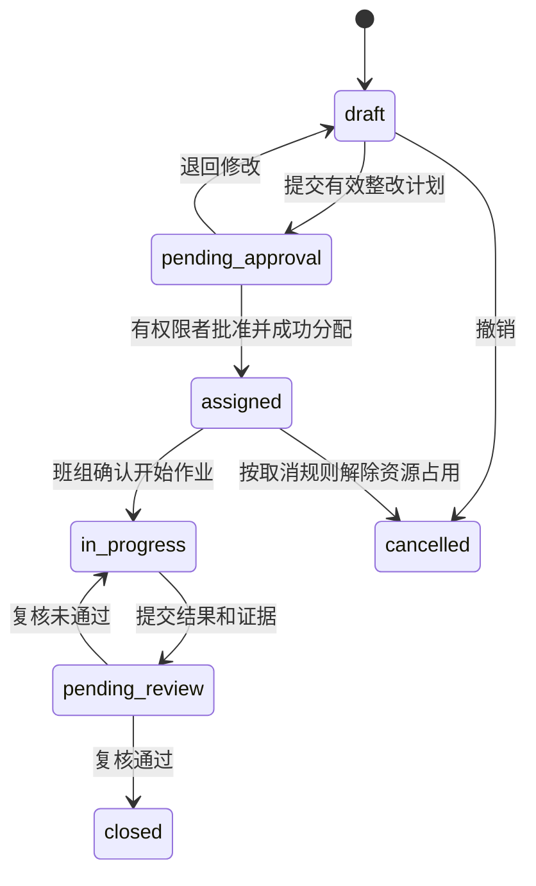

[[00-爱化身入职学习地图]] · 前置：[[DATA-01-数据库SQL与数据接入]] · 后续：[[DATA-03-知识图谱GraphRAG与语义层]]

> [!abstract] 这篇是岗位核心
> JD 明确要求把业务流程转成对象、关系、事件、规则和数据需求。本篇目标是让你在白板上完成一个可验证的小型本体，而不是背哲学定义。P0 先读第 1—6 节及话术，约 30 分钟；P1 学第 7—9 节。环卫样例是教学设计，不是爱化身内部模型、平台 API 或客户真实规则。

## 1. P0：本体究竟多做了哪一步

数据库可能知道“表 A 的 code=17，表 B 的 street_code=017”，但不知道它们是否指同一个责任路段、该路段属于哪份合同、谁能处理异常、处理完以什么证据关闭。本体把这些业务概念、关系和约束显式化，让不同系统和人能围绕相同对象讨论。

**Schema 是类型及规则，instance 是具体事实。** `RoadSegment` 是对象类型，`R-017` 是一段具体道路；“WorkOrder 必须关联一个 RoadSegment”是建模约束，“WO-101 位于 R-017”是实例事实。“工单首次进入执行中前必须已派发”是行为约束，“WO-101 已于 10:03 开始执行”是一次事件。

不要把“道路、车辆、班组”三个词画成气泡就称为完成本体。能支撑业务的问题是：道路多长、按什么方向划分、谁负责、从什么时候负责、什么事情发生后可以执行哪个动作、需要谁批准、失败如何处理。好的本体最终可被查询、校验和用例检验。

学术及语义网本体常用类、属性、个体和逻辑公理表达知识；企业操作型本体还可能结合动作、权限、事件和工作流。这不是“只有使用 OWL 才算本体”，也不是“所有公司的本体实现都相同”。[OWL 2 Primer](https://www.w3.org/TR/owl2-primer/) 展示一种正式知识表达体系；[Palantir Ontology](https://www.palantir.com/docs/foundry/ontology/overview) 是另一家公司产品的可参考范例，不能据此推定 Agentrix 的技术实现。

## 2. P0：先定业务问题，再取最小模型

教学问题固定为：“异常巡检出现后，在合同要求内派出合适资源，并形成整改证据。”对应三条验收问题：能找到责任单位吗？能找到符合条件的可用资源吗？能证明工单为何以及何时关闭吗？这三条就是 competency questions，即用于判断模型是否足够的业务问题。

| 对象类型 | 一条实例的粒度 | 核心字段 | 主要业务关系 |
|---|---|---|---|
| RoadSegment | 一段有边界和方向的责任路段 | road_id、几何边界、等级、项目 | 受 Contract 约束；由 Team 负责 |
| Inspection | 一次巡检观察，不是整个问题生命周期 | inspection_id、发生时间、问题类型、证据 | 观察 RoadSegment；可支撑 WorkOrder |
| WorkOrder | 一次独立整改任务 | work_order_id、状态、截止时间、版本 | 位于 RoadSegment；执行方 Team；使用 Vehicle |
| Vehicle | 一辆有稳定内部 ID 的车 | vehicle_id、车型、能力、当前状态 | 归属 Team；被分配给 WorkOrder |
| Team | 一个组织作业单元 | team_id、项目、能力、值班时间 | 承接 Contract；服务 RoadSegment |
| Contract | 一份合同及明确版本 | contract_id、版本、有效期、条款来源 | 约束责任路段和作业要求 |

第一版可以把一张工单限定到一个责任路段，以压缩 POC 范围。若生产任务可跨多条路，应引入工单明细或关联实体 `WorkOrderRoadSegment`，不要继续塞逗号分隔的道路 ID。车辆与工单也可能多对多，并且只在某时间段占用；简单的“车辆当前工单”字段不足以安排未来任务。

**实体不一定等于源表，关系也不一定只是一条线。** 道路归属某班组有生效时间、责任比例和来源文件；当这些信息重要时，应把 `ResponsibilityAssignment` 建成带属性的关系记录。这样调换班组后，历史申诉仍能找到当时责任人。

## 3. P0：从混乱编码得到同一个业务身份

设 GPS 系统叫“中山路东段”，工单系统叫“中山东”，合同 PDF 写“中山路 K0+000—K0+600 南侧”。文本相似只能发现候选，不能自动证明三者是同一对象。先用项目、空间边界、道路方向和合同段号做匹配，再让业务负责人确认疑难项。

建议建立映射表：`source_system + source_id → canonical_id`，同时保存 `match_method`、`confidence`、`reviewer`、`valid_from/to`。确定性精确匹配可自动处理；模糊匹配进入待确认队列；无法确认则维持不同对象。宁可暂时缺一条关联，也不要把两条同名道路混为一条并错误派车。

主键策略需要回答“对象改名是否换 ID”。通常道路改名不换稳定 ID；道路拆分、合并则应生成新对象并保留前后继关系。车牌变更不代表换车；设备换装则要区分车辆对象与传感器对象。否则历史轨迹会被错误接到新设备或新路段。

公司所说的统一语义，售前可以用上述步骤解释其业务价值；不能承诺“模型自动知道所有字段怎么对应”。落地时仍需要数据负责人、领域专家、样本验证和映射版本。

## 4. P0：事件、动作和状态机是三件不同的事

**事件是已经发生的事实，动作是希望执行的命令，状态是某时点的业务情况。** `InspectionReported` 是事件；`CreateWorkOrder` 是动作；`pending_approval` 是状态。动作可能被拒绝或失败，因此“发出指令”不能直接当成“已完成”。



这是教学状态机，不是公司既有工单状态。每条边都要定义允许操作者、输入、前置条件和副作用。例如 `CloseWorkOrder` 的输入包括工单 ID、预期版本、复核结果和证据 ID；前置条件是状态为 `pending_review`、复核者有相应权限且证据满足要求；成功后更新状态并记录事件；前置条件不满足则拒绝并解释原因。

```json
{
  "action": "AssignWorkOrder",
  "work_order_id": "WO-101",
  "team_id": "T-02",
  "vehicle_id": "V-07",
  "expected_version": 4,
  "idempotency_key": "req-demo-101",
  "reason": "示例：车辆能力匹配且处于可用状态"
}
```

上面只是业务动作契约示意。`actor_id`、角色和项目范围必须来自可信认证上下文，不能让模型在 JSON 里自称管理员。`expected_version=4` 表示“基于我看到的第 4 版执行”，若工单已被人工改为第 5 版，需重新读取并判断，避免覆盖人类刚做的调整。

事件记录应包含 event_id、发生时间、入库时间、对象 ID、操作主体、前后状态、关联动作、源系统及版本。保留失败与拒绝也很重要：“为什么没有派车”可能比“为什么派了车”更需要解释。完整执行机制见 [[DATA-04-企业集成权限部署与可靠执行]]。

## 5. P0：规则需要分类型，也需要负责人

数据约束回答“记录是否合法”，如 road_id 必填、结束时间不能早于开始时间。业务规则回答“该做什么”，如模拟合同规定某类异常需在约定时限内响应。资源约束回答“做得到吗”，如车辆需要具备清洗能力、班组处于值班时段。权限规则回答“谁有权做”，如跨项目调度需指定负责人审批。

规则还分硬约束与软偏好。车辆维修中不可派遣是硬约束；尽量减少空驶是软目标。把两者都塞入一句提示词，模型可能为了“更快”越过硬约束。应由服务端规则或约束求解器剔除非法方案，再对可行方案排序，LLM 负责解释和交互。

“雨天不要洒水”也不应被写成全行业绝对规律。应确认当地作业要求、雨量定义、场景例外和适用合同，并记录规则 ID、来源、生效期、版本、批准人及测试案例。业务人员提出经验后，先变为可审阅规则，再启用；不是聊天中说一句就让生产规则永久改变。

规则冲突时不要让模型任意选择。例如两份有效文件对同一路段给出不同截止时间，系统应显示冲突并交由指定规则负责人裁决。若要求“更严格优先”，也要把优先级本身变成经批准的规则。

## 6. P0：本体为什么不能自动预测，也不能消除幻觉

`Vehicle belongsTo Team`、`Team responsibleFor RoadSegment` 可以支持关联检索；它们并没有给出“车辆 20 分钟后到达”的速度预测模型。把关系正确连起来不等于知道未来。预测要有时间序列、特征、模型及误差评估；行动优化还需要目标和约束。

同样，本体可以减少歧义并约束工具输入，但数据可能错误、实体可能误合并、规则可能过期、模型可能错误解释结果。如果图里有“R-017 关联 C-05”，并不能证明大模型后来声称的“此合同罚款 500 元”来自事实。应把结论与具体条款、版本、计算和执行记录绑定。产品介绍里的“极低幻觉率”等价值主张，需要用指定任务、样本和指标验证，不能直接转成无条件承诺。

## 7. P1：时间、空间和血缘让模型经得起追问

只存 `current_team=T-02`，只能回答今天谁负责，不能回答上周谁负责。有效时间表示现实中何时成立，系统时间表示平台何时获知。9 月 5 日补录一条“9 月 1 日开始由 T-02 负责”的信息，两条时间轴不同；保留二者可以解释当时为什么给了旧班组建议。

空间模型也不只是经纬度。要确认坐标系、道路边界、方向、空间匹配误差及轨迹与责任区的关系。GPS 点落在道路附近，不必然证明车辆完成清扫；可能是经过，也可能设备定位漂移。需要结合速度、作业设备状态、停留区间和业务认可的证据标准。

血缘是“这个结论如何产生”的可追溯关系。示例：源巡检照片 → 视觉识别结果 v2 → 人工确认的 Inspection → 合同规则 v3 → 建议工单 → 审批 → 写回回执 → 复核证据。每个阶段应有来源 ID、转换版本、时间和责任主体。W3C PROV 用实体、活动、代理者组织来源信息，可作理解参考；你不必在 POC 里全面实现该标准。[PROV 官方概览](https://www.w3.org/TR/prov-overview/)

不要把模型内部推理文本当作血缘。能审计的依据是输入快照、规则版本、调用参数、工具结果和批准记录，不是“AI 说自己认真考虑过”。

## 8. P1：理解形式本体、图谱与约束验证的边界

RDF 可以用三元组表示“工单 WO-101 位于道路 R-017”；OWL 可以描述类及逻辑关系；SHACL 可描述并验证 RDF 数据形状，例如一张工单必须恰好有一个 road_id。正式推理与数据校验目的不同，不能把所有业务校验都寄希望于推理机。[RDF 入门](https://www.w3.org/TR/rdf11-primer/) · [SHACL 规范](https://www.w3.org/TR/shacl/)

公司技术问答已公开提及混合推理，具体摘要见 [[数据架构来源#AHS-W04：公开技术问答，建议入职前精读]]。入职时要确认 OWL 负责哪类推理，哪些检查由其他规则、代码或审批机制完成；本篇介绍 SHACL 只为区分概念，没有证据证明公司采用它。

OWL 常用开放世界语义：某事实未记录，不代表它为假。因此“未找到作业记录”不能自然推出“没有作业”。数据库业务应用常在明确范围内采用封闭世界假设，但要先定义数据覆盖范围。售前能意识到未知与否定的差异，已经比只会术语解释更接近工程实践。

也无需一开始追求“全城市本体”。先做一个合同、几条路段、一次异常闭环；当新场景复用道路、组织和动作定义时再扩展。反过来，每个 Demo 私自发明一套“已完成”的含义，会使资产无法复用。应有本体词汇表、变更说明和影响分析，例如新增状态是否破坏旧看板与旧 Agent。

## 9. Workshop 演练、自测与答案

**15 分钟练习：** 客户说“投诉来了后，AI 找最近车辆处理，做完自动销单”。先别画技术架构。请逐项补问：投诉与巡检是不是同一个对象？重复投诉如何归并？最近按直线还是行驶时间？车辆有没有相应能力和班次？谁可跨区调度？何种证据可销单？系统多久更新一次？然后只建最小对象和动作。

**参考模型：** 投诉作为输入事件或新增 Complaint 类型，经确认形成 Inspection/问题记录；关联 RoadSegment、有效 Contract、当前 Team 和候选 Vehicle；生成 WorkOrder 草案；做能力、权限及状态校验；批准后派发；收到执行回执进入待复核；复核通过才关闭。“最近车辆”只是可行资源排序的一项指标。

**自测 1：** “环卫车辆是车辆的一类”和“V-07 属于 T-02 班组”区别是什么？

**答案：** 前者是 schema 层的类型关系；后者是实例层的业务关联，且可能带有效时间。不要用同一种“属于”箭头混淆继承和组织归属。

**自测 2：** 同一张工单的地图、报表、Agent 都显示同一个 ID，本体就完成了吗？

**答案：** 只解决了身份的一部分，还需统一状态、指标口径、关系、规则、权限、时间及动作契约，并验证数据来源和实际用例。

**自测 3：** 一段合同文字被 LLM 抽取成规则，能马上自动派车吗？

**答案：** 不能直接据此启用。需核对条款、适用范围、时效、例外和负责人批准，转为可校验规则并测试正常、缺失、冲突与越权样本。

## 10. 30 秒客户话术

“我们把道路、车辆、班组和合同定义成共同的业务对象，让不同系统知道自己说的是同一件事；再补上对象之间的责任关系、当前状态、作业规则和允许的动作。这样 AI 才能说明为什么建议派这辆车、谁需要批准、执行后怎样验收。第一步会选一个小闭环，和业务人员一起验证这些定义。”

来源、公司事实边界：[[数据架构来源]]。推演与优化继续看 [[DATA-05-世界行为模型与可验证决策]]。
