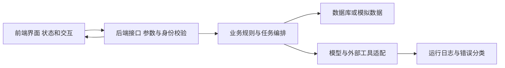

# AI Coding快速原型与排错工作法

返回 [[00-爱化身入职学习地图]] · 母笔记 [[PRE-02-Demo工作坊与POC设计#2. 半天 Demo 的方法：做一条完整链路，减少横向功能]]、[[AI-04-Function Calling与API工具设计]]。

**P0：第1、2、5节，其他入职后按项目补。**JD要求至少掌握一种开发组合，不要求五天同时精通Python、TypeScript、React、Vue和后端框架。选择自己已能运行、能排错的一套，把不熟悉部分交给AI辅助，并保留理解和验证责任。

## 1. 半天原型的真正前提

快速不是把所有代码都让AI一次生成。快来自范围小、组件可复用、接口明确、样例准备好，以及你能迅速发现生成结果中的错误。半天完成的通常是概念原型，不包含真实企业全量数据治理、完整鉴权适配与生产运维。

先写一页“原型契约”：使用人是调度员；问题是人工找资源慢；输入是模拟巡检和车辆状态；输出是带排除理由的建议与模拟工单；本期只含一个片区、一类事件；明确不控制真实设备；验收包括成功、无资源、越权和重复请求四条路径。这个契约能防止AI自行扩成庞大平台。

你的UrbanScope可以复用地图、对话、图层和分析结果组件，但业务对象层与动作安全仍需补。是否能复用原项目代码，还要看代码归属、内部保密与公司规定；个人学习可以先复用方法和模拟数据结构。

## 2. 必须能看懂的一张开发图



**前端**负责输入、展示、加载/空状态/失败反馈，不是权限的最终裁判。**后端**保存密钥、校验身份与数据范围、处理业务规则和调用。**数据库**负责持久状态和约束。**适配层**隔离模型、地图和客户API，减少替换厂商时的改动。

HTTP请求至少看方法、路径、请求头、请求体、状态码与响应体。GET一般用于读取；POST常用于创建或触发动作，但方法名不能替代业务语义与权限。401常与身份认证有关，403常与权限有关，429常与限流有关，5xx通常需检查服务端或上游；实际以接口规范和日志为准。

JSON可交换结构，但字符串"100"与数值100、null与空字符串、UTC与北京时间都可能导致业务错误。SQL JOIN可能使一对多关系重复计数；缺失值不应随意改成0；前端TypeScript类型并不会自动校验网络输入。写代码时都要把这些细节当作验收项。

## 3. 给AI开发工具的四段任务模板

```text
背景与结果：
为调度员做模拟环卫原型，只验证“核验事件→推荐资源→审批后模拟派单”。
禁止连接生产数据或设备。始终显示“教学模拟”。

数据与规则：
先读取现有项目结构和scenario.json，复用既有技术栈。
车辆须在授权片区、具备能力、空闲，定位不超过10分钟且不能来自未来。
无合格候选时明确返回原因。审批后执行前重新核验状态版本。

接口与边界：
先给出接口输入输出和状态表，再实现一个最小垂直流程。
密钥只能放在服务端配置；不要把客户端传来的角色当作真实授权。
执行模拟器与真实接口适配层必须清楚区分。

验收与反馈：
覆盖成功、位置过期、错误能力、越权、重复请求、状态冲突。
给出运行命令、验证结果、修改文件、未实现边界。
不要以“看起来工作正常”代替运行证据。
```

模板变量包括具体用户、场景、技术栈、数据范围、规则阈值和验收例子。把一次任务限制成可审查改动，先让API在模拟数据上返回正确结果，再连接UI；最后再增加自然语言入口。不要一开始同时改地图、Agent框架、数据库与部署。

## 4. 从需求到可演示版本的工作顺序

**先清点。**看README、目录、依赖、环境样例、现有运行方式和版本控制状态，避免为了演示重建一套不兼容技术栈。

**再形成垂直流程。**一个输入表单或事件列表→一个建议接口→结果卡→模拟审批与回执。每个页面同时有加载、空数据、失败和成功状态。演示当天只做确定范围内的主流程，其他需求登记。

**然后核验。**代码检查应关注输入验证、跨租户访问、秘密配置、错误处理、幂等、日志与依赖，而不仅仅是界面有没有报错。AI能写出测试，也可能把实现中的错误写进预期结果，所以你需要从业务反例定义验收。

**最后部署与预检。**本地运行成功后，再确认演示机器的环境变量、端口、网络、API配额、数据文件和模型可用性。原型可本地展示或在获授权环境中部署；正式客户环境需要按团队流程处理身份、密钥与接入。保留明确标注的缓存/回放和讲解截图作为备用。

Git里能看懂工作区、暂存区、提交、分支和差异即可开始。每一项可运行改动形成可回退版本；不要把密钥、客户数据和不该共享的日志提交进仓库。打包演示资产时记录版本和启动方式，否则同事无法复用。

## 5. 现场失败：按链路找证据

| 症状 | 第一轮检查 | 不要急着做什么 |
|---|---|---|
| 页面空白 | 浏览器错误、构建、路由、资源是否加载 | 不先换模型 |
| 请求没发出去 | 按钮状态、请求参数、前端异常 | 不猜客户网络一定有问题 |
| 401/403 | 身份、令牌有效性、授权范围 | 不在前端硬编码高权限凭据 |
| 429 | 请求速率、并发、配额、重试策略 | 不无限并发重试 |
| 返回200但没有结果 | 响应体、分页、过滤条件、数据版本 | 不编造结果来填界面 |
| 模型答错条款 | 文档解析、检索、版本、引用支持 | 不只改“请更准确” |
| 同一工单重复出现 | 请求是否重试、幂等键、回调去重 | 不靠手动删一条掩盖根因 |
| 地图位置偏移 | 坐标系、经纬顺序、转换链 | 不随手加偏移量凑合 |

对客话术：“这一步实时接口没有得到预期结果。我先切换到已标注的回放数据，继续说明业务流程；会后根据请求与返回日志确认具体原因。”只有查到证据后，才说是限流或第三方故障。

## 6. 面对代码你要具备的最低独立判断

能指出密钥在哪；能找到用户输入如何进入SQL/API；能解释为什么只有后端鉴权有效；能看懂错误是网络、数据还是逻辑；能从输入推出期望结果；能恢复到上一个可运行版本。不会手写所有代码不妨碍你使用AI，但这六项决定你能否可靠承担原型。

**20分钟练习：**读[[LAB-01-城市环卫闭环桌面演练]]中的脚本，定位选择车辆的条件、幂等字典、版本检查和模拟状态。回答：为什么这个脚本不能直接上线？参考答案：无真实认证、持久化审批和事务、并发约束、生产审计与完整运维；模拟时钟和内存状态只为教学。

建议把新代码学习与真实公司技术栈绑定。Python路线优先补数据结构、函数、异常、JSON、HTTP、SQL；TypeScript路线优先补对象/数组、异步Promise、类型与运行时校验、请求状态、组件与API分工。不为了凑知识量同时换框架。
