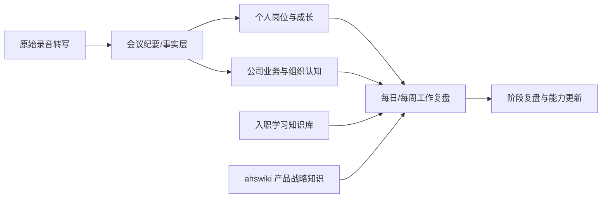

# 爱化身工作复盘

> [!abstract] 定位
> 这里保存入职后的**工作事实、会议结论、个人成长和行动复盘**。产品教材继续放在[[00-爱化身入职学习地图|爱化身入职学习知识库]]，公司产品与战略知识继续参考[[INDEX|ahswiki 索引]]。

## 当前入口

1. [[2026-09-16-入职沟通会议纪要]]：两段入职谈话的完整结构化纪要。
2. [[我的岗位定位与负责人期待]]：只看与“我”相关的要求、评价和发展方向。
3. [[入职后30-60-90天成长路线]]：把负责人提出的阶段目标转成可执行计划。
4. [[入职首月行动清单]]：第一周和第一个月可直接推进的任务。
5. [[公司业务与组织认知-入职谈话版]]：本次会议中形成的公司、业务和组织认知。
6. [[负责人业务理解与通俗表达素材库]]：负责人对业务的比喻、解释结构和可复用表达。
7. [[入职谈话术语与口径]]：本体、DataOS、AgentOS、实控人等概念速查。
8. [[日周工作复盘模板]]：以后持续积累工作记录的统一格式。

## 原始资料

- [[负责人关于入职的相关介绍1]]：32 分 41 秒，偏公司业务、产品、客户与组织介绍。
- [[负责人关于入职的相关介绍2]]：1 小时 15 分 52 秒，偏业务流程、岗位要求、成长路径和录用原因。

## 与现有知识库的关系

- **本文件夹：**记录“发生了什么、负责人要求什么、我做了什么、结果如何”。
- **[[00-爱化身入职学习地图|入职学习知识库]]：**记录“我需要学什么、如何练习”。
- **[[INDEX|ahswiki]]：**记录“公司产品、战略和售前方法论是什么”。

## LLM 使用约定

为了避免模型把口述、推断和正式制度混为一谈，统一使用以下证据标记：

- **【明确】**：负责人在会议中直接说出，或双方明确确认。
- **【归纳】**：依据多段谈话形成的总结，不等同负责人原句。
- **【待核验】**：涉及正式考核、客户数据、人物履历、公司资本信息等，只有口述证据。
- **【个人计划】**：为落实会议要求制定，尚未获得负责人确认。

使用本库回答问题时，优先级为：**正式公司文件 > 经确认的会议结论 > 原始转写 > 个人归纳 > 个人计划**。

> [!warning] 保密提醒
> 本库含公司内部业务、客户案例、人员和商业策略口述。调用外部 LLM 前应遵守公司数据与保密要求；客户名称、金额、数据和人员信息应先脱敏。

## 维护节奏

- 每次重要会议：保存原始材料，新增会议纪要，并链接涉及的主题笔记。
- 每天下班前：用[[日周工作复盘模板#每日复盘模板|每日模板]]记录事实、成果、卡点和下一步。
- 每周：更新一次[[日周工作复盘模板#每周复盘模板|周复盘]]，关注业务贡献、能力增长和可复用资产。
- 每月：回看[[入职后30-60-90天成长路线]]，更新实际进展与负责人反馈。
