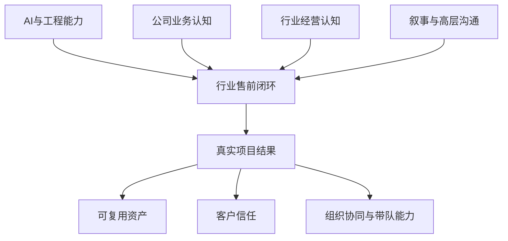

# 我的岗位定位与负责人期待

## 一句话定位

> **【归纳】我不是单一技术执行或传统方案岗位，而是要成长为能够融合 AI 工程、行业经营、售前方案和高层叙事，并独立完成业务闭环的复合型人才。**

## 负责人看中我的地方

| 负责人观察到的信号 | 对我的含义 | 后续应如何证明 |
|---|---|---|
| 已经主动为转向 AI 做过实际投入 | 不是追热点，具备真实动机 | 持续产出真实可用的 AI 工作成果 |
| 在建筑设计院环境中仍主动跨出第一步 | 自驱、能突破环境限制 | 面对陌生行业继续主动学习和迁移 |
| 展示平台时从业务角度叙述 | 具备售前和产品叙事潜力 | 每次方案先讲经营问题、价值和决策 |
| 会琢磨、谨慎、有边界感和克制 | 能在严肃 B 端场景建立信任 | 不夸大产品能力，明确事实、假设与待核验项 |
| 有人味、为人正 | 适合长期协作和高层沟通 | 对内成全同事，对外尊重客户，围绕问题做事 |
| 具备编程和工程化能力 | 能把叙事做成可交互成果 | 独立完成行业 Demo、驾驶舱或垂类场景闭环 |
| 有“underdog”成长潜力 | 负责人相信资源到位后成长会很快 | 用稳定迭代而非单次惊艳兑现潜力 |

## 对我的明确要求

### 1. 懂公司业务，而不是只会技术

- 能说清公司为什么做企业 AI 操作系统。
- 能说清 DataOS、AgentOS、本体和智能体集群之间的关系。
- 理解公司选择什么客户、为什么先做经营面、项目如何推进。
- 能把产品能力对应到客户真正关心的收入、成本、效率与风险。

### 2. 建立行业 know-how

- 选定一个行业深入学习，而不是不停寻找更容易的方向。
- 理解该行业的经营指标、业务对象、作业链路和关键约束。
- 找到 AI 进入行业的抓手、边界和优先顺序。
- 把行业认知转成可演示、可验证、可复用的方案资产。

### 3. 对结果有 Owner 意识

- 接到目标后自己拆解阶段、风险和所需资源。
- 不等待负责人把每一步写清楚。
- 主动协调技术、设计、销售、投资或行业专家。
- 参与关键细节，对最终交付质量和业务效果负责。

### 4. 能与 CEO 和 CTO 建立信任

- 对 CEO：用经营和资本叙事讲未来图景与业务价值。
- 对 CTO：能够解释技术机制、数据链路、边界和参数差异。
- 遇到挑战不回避、不虚构、不轻易把问题推给其他同事。
- 在高层场合保持不卑不亢，让对方感受到专业度和判断力。

### 5. 持续迭代并成就他人

- 单次失败不代表能力上限，重要的是复盘和下一次改进。
- 长期积累认知复利，不做只顾当下收益的投机选择。
- 在团队中提供资源、工具、知识和连接，而不是只完成自己的部分。
- 未来带团队时，能够识别他人的特长并帮助其成长。

## 岗位能力模型

| 能力层 | 达标表现 |
|---|---|
| AI/工程 | 能快速做出稳定、可解释的场景原型，清楚真实数据、模拟数据和目标能力的边界 |
| 公司业务 | 能讲清产品、客户、商业模式、项目流程和交付关系 |
| 行业经营 | 能从 CEO 视角找到经营问题，并形成场景优先级 |
| 售前叙事 | 能把复杂技术讲成具象的经营价值，而非功能清单 |
| 对客应变 | 能面对追问、质疑和数据差异，保持可信并推动下一步 |
| Owner | 能主动拆解、调资源、交付、复盘并沉淀资产 |
| 组织能力 | 能成就他人，把不同角色组织成共同解决问题的队伍 |

## 两条可能的发展路径

### 路径 A：产品/工程化场景负责人

- 深入 AOS、行业驾驶舱或垂类 Agent 场景。
- 把客户说不清的目标提前做成可交互平台。
- 形成可复用的行业产品、演示组件和交付方法。
- 条件成熟时负责某一产品方向或行业场景团队。

### 路径 B：高层售前/业务叙事与协同负责人

- 强化 CEO/实控人沟通、资本叙事和经营判断。
- 把高度抽象的技术压缩成清晰、有画面感的表达。
- 推动内部销售、技术、交付和外部客户形成共同节奏。
- 逐步独立主持客户会议和项目推进。

两条路径并不互斥。现阶段最有价值的组合是：**用工程能力做出可信场景，用业务叙事把价值讲透。**

## 隐含的评价标准

以下是依据谈话的归纳，并非正式 KPI：

- 主动性和学习速度；
- 是否愿意快速进入真实项目；
- 能否自己形成闭环；
- 对业务的投入深度，而非只掌握表面术语；
- 面对压力、变化和失败时的韧性；
- 价值观、边界感和团队协作方式；
- 是否逐渐形成让内部高管和外部客户都愿意信任的专业度。

## 我的提醒

> [!warning] 不要把“珍惜机会”理解成无限透支
> 谈话中的优秀样例普遍投入度很高，也包含周末主动参会和长时间工作。我要主动投入，但仍应通过优先级确认、阶段交付和可持续节奏来保证长期表现。负责人强调的是“流水不争先，争的是滔滔不绝”。

> [!tip] 不要因害怕暴露上限而停止行动
> 工作不是一次考试。允许做错，但必须及时说明、解决、复盘和迭代。

相关：[[入职后30-60-90天成长路线]]、[[CO-01-为什么录用你与岗位能力地图]]。

