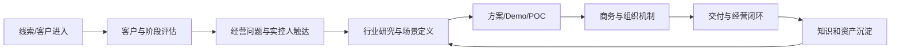

# 公司业务与组织认知（入职谈话版）

> [!warning] 使用边界
> 本文只总结 2026-09-16 负责人的内部口述，方便我快速建立认知。产品名称、组织关系、客户数据、项目金额、人物履历和资本计划应以公司正式材料为准。

## 公司在解决什么问题

传统企业有多套系统，同一个人、车辆、订单或项目在不同系统中可能有不同编号和字段。通用大模型即使能力很强，也不天然理解这些记录指向同一业务对象，更不知道企业内部的权限、关系和动作规则。

公司的核心思路是：

1. 不先替换客户原有系统；
2. 在原系统之上建立统一业务语义层；
3. 把对象、关系、事件/动作和底层数据关联起来；
4. 让 AI 能准确读取企业事实，并进一步辅助决策和执行；
5. 将经营与作业知识逐步沉淀为企业自己的智能能力。

## 产品逻辑

| 层次 | 会议中的理解 | 价值 |
|---|---|---|
| DataOS/本体 | 统一多系统数据和业务语义，构建对象、关系、动作 | 让 AI 理解企业事实、减少上下文、增强追溯 |
| AgentOS | 在本体上运行和协同多个智能体 | 把企业知识转成岗位辅助、协作和执行能力 |
| 行业场景/智能体 | 围绕经营、作业和岗位放入具体应用 | 在真实业务中降本、增收、提效、降低风险 |
| 企业专用模型/行为模型 | 基于企业闭环知识形成更深层能力 | 会议中属于更长期或高价值项目方向，具体机制待核验 |

## 客户选择

负责人描述的理想客户具备以下特征：

- 经营体量足够大；
- 员工和系统规模大，传统管理方式接近上限；
- 实控人控制力强；
- 有明确变革动因；
- 决策速度和商业能力较强；
- 能从经营结果而非单点功能评估价值。

重点方向包括泛金融、泛制造、泛资源能源、城市服务、水务、交通运输等。央国企项目需考虑招标周期、触达层级和推进模式；海外侧关注中东、非洲等市场。以上均为会议口述口径。

## 为什么先做经营面

作业侧往往高度非标，可能涉及视觉模型、设备、传感器、控制系统和专业算法，交付周期长、风险高。经营面更接近 CEO 的核心问题：

- 哪个业务赚钱或亏钱；
- 成本花在哪里；
- 哪些效率问题最值得先解决；
- 哪些数据能支持经营决策；
- 哪些环节适合放入智能体。

因此先扫描经营面，找到高价值场景并积累行业知识，再逐步进入作业面。

## 对客原则

- 不把自己定位为传统乙方，而是以专业认知定义企业 AI 变革路径。
- 强势不是蛮横，而是认知、判断和方案完整度足够强。
- 不是堆砌功能，而是围绕客户经营目标构建未来图景。
- 不只讲愿景，还要给出场景、路线、机制、排班、商务和下一步动作。
- 对客更像一场路演：让实控人愿意押注这条变革路径。

相关：[[企业级AI对客战略总纲]]、[[爱化身对客六条硬规则]]。

## 业务推进方式

评估维度包括客户类型、触达层级、变革动因、体量、商业能力、决策速度和项目阶段。业务运营中心负责逐步标准化这些流程，项目群机器人和看板用于自动收集进展、下周待办及 AI 反馈。

## 本次会议涉及的组织

| 团队/角色 | 会议中的职责理解 |
|---|---|
| 成交运营专家组 | 业务定义、项目运营、对客材料、场景和协同；我所在的组 |
| 销售 | 连接客户和实控人，推进商业机会；成员普遍具备较强行业和高层沟通经验 |
| 技术方案专家组 | POC、技术方案和内容，与成交运营存在协同和一定交叉 |
| 业务运营中心 | 商机阶段判断、流程推进、项目健康度与看板 |
| 产品孵化中心 | 产品迭代与孵化 |
| FD/交付团队 | 进入客户现场落地智能体和业务场景 |
| 前沿合作/市场 | 获取市场信息、创业者和潜在线索，组织黑客松等活动 |
| 品牌、财资战略、综合管理、HR | 分别负责品牌、投资/资本、财法事务和人才发展等 |

## 工作文化

- 高自由度、高责任和高变化速度并存。
- 强调真实项目、一线手感和快速认知迭代。
- 允许犯错，但要求解决问题、复盘并继续前进。
- 组织倾向扁平和网状协作，不鼓励部门壁垒或“铁帽子王”。
- 看重善意、成就他人、业务专业度和长期认知复利。

