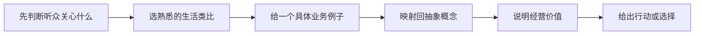

# 负责人业务理解与通俗表达素材库

## 为什么单独整理

负责人不只是介绍公司业务，还示范了一个关键能力：**把抽象的技术、商业模式和成长逻辑，翻译成听众熟悉、脑中能形成画面的语言。**

这正是他希望我长期建立的“描述事情的质感”。本笔记不只是摘抄金句，而是分析每个表达在解释什么、为什么有效、如何复用，以及使用时需要注意什么边界。

## 一、产品与技术类比

### 1. 企业是城市，各套业务系统是城市里的楼房

**来源：**记录1，01:06—02:29。

**负责人的表达逻辑：**如果一家企业是一座城市，ERP、人力和业务系统就是不同楼房。通用大模型进入企业后，并不天然知道每栋楼里相同名称或不同编号的数据实际上指向同一个人。

**解释的概念：**数据孤岛、实体解析、统一业务语义层和本体。

**为什么有效：**

- “多系统”被转换为人人熟悉的“多栋楼”；
- “字段映射”被转换为寻找同一个人；
- 抽象的数据治理问题变成了具体的城市认路问题。

**我可以怎样复用：**

> 企业不是没有数据，而是数据住在不同的楼里。我们先给这些楼建立一套统一的地址和身份体系，AI 才不会把同一个人当成三个人。

**边界：**本体不只是把字段“对上号”，还涉及业务定义、关系、事件、动作、权限和时效性；面对技术人员要继续展开。

---

### 2. 同一个人在三个系统里有三个身份

**来源：**记录1，01:06—02:29。

负责人以“姓名、员工001、工号A0329其实是同一个人”为例，解释为什么模型不能只看字面值，而要有统一对象身份。

**解释的概念：**主数据、实体消歧、跨系统身份映射。

**可复用结构：**

1. 先选一个听众熟悉的对象；
2. 展示它在不同系统里的不同名称；
3. 说明不统一会导致什么错误；
4. 再引出本体如何建立统一指向。

这个结构可以迁移到车辆、客户、订单、合同、设备和项目。

---

### 3. 企业是手机，岗位 Agent 是 App，公司提供操作系统

**来源：**记录1，07:32—09:18。

**负责人的核心比喻：**每个岗位的 Agent 像手机上的 App，但多个 App 要运行和协同，需要统一的 iOS/Android。公司要做的是企业级操作系统，而不是只做某一个垂类 App。

**解释的概念：**平台与单点应用的区别、Agent 集群、统一数据和协作基座。

**为什么有效：**客户无需理解复杂架构，也能立刻区分“一个工具”和“一套平台”。

**我可以怎样复用：**

> 给财务、人力、销售各做一个 Agent，只是在企业里多装了几个 App。真正困难的是：这些 App 是否认识同一个客户、遵守同一套权限、共享同一份业务事实，并能协同完成任务。我们解决的是操作系统层的问题。

**边界：**“操作系统”是产品定位类比，不应让技术客户误解为替代 Windows、Linux 或客户全部现有软件。

---

### 4. 公司卖的像企业的“经络”

**来源：**记录1，07:32 附近。

**解释的概念：**公司不是只增加一个孤立系统，而是连接企业中的信息、岗位和动作，让数据与智能能够流动。

**可复用表达：**

> 单点软件解决一个部位的问题，本体和 Agent 协同更像贯通企业经络，让信息、判断和动作能够跨部门流动。

**边界：**该类比富有感染力，但缺少技术精度；后续要补“连接哪些数据、形成哪些动作、如何受权限控制”。

---

### 5. 大模型有通识，企业真正稀缺的知识在组织脑中

**来源：**记录1，14:39—16:48。

负责人用“通用模型已经吸收大量公共知识，但企业私域中仍有大量行业和组织知识”解释企业 AI 的价值。

**解释的概念：**通用智能与企业私域知识的差异、企业上下文和专用能力。

**更稳妥的复用版本：**

> 通用模型懂大量公共知识，但它不知道这家企业独有的客户、规则、流程、例外和历史决策。企业 AI 的关键不是再教模型一遍常识，而是让它在权限范围内理解并使用这些组织知识。

**边界：**负责人使用过“80%/20%”等比例作为叙事表达，不能当作经验证统计数据对外引用。

---

### 6. 网球飞来：Agent 会分析，模型可能形成下意识反应

**来源：**记录2，12:22—13:43。

负责人以网球飞来为例：如果每次都显式分析速度、质量、材质和躲避方式，更像智能体的逐步推理；经过学习形成的模型可能直接产生快速反应。

**解释的概念：**显式规划/工具编排与端到端模式学习之间的直觉差异。

**边界：**这是直觉类比，不是严格技术定义。模型也可能进行推理，Agent 也经常依赖模型；正式讲解时应说二者是不同层次的组合，而非绝对二分。

---

### 7. 把老专家脑中的经验“蒸馏”出来

**来源：**记录1，32:12；记录2多处。

水务等行业的加酸加碱经验可能长期存在老专家脑中。负责人用“蒸馏”描述将经验提取、结构化并让系统辅助使用的过程。

**解释的概念：**隐性知识显性化、专家规则沉淀和人机协同。

**更合适的客户表达：**

> 我们不是替代专家，而是把专家多年形成的判断依据、适用条件和例外沉淀下来，让经验可传承、可追溯，也让专家把时间放在真正复杂的判断上。

**边界：**避免使用“把人蒸了”等内部玩笑式说法面对客户；需要强调专家审核、风险控制和责任边界。

## 二、经营与客户价值表达

### 8. 老板不关心垃圾如何分类，老板关心哪里赚钱、哪里亏钱

**来源：**记录2，02:36—03:34；30:44—31:39。

**解释的概念：**产品能力必须映射到 CEO 的经营问题，技术亮点不等于购买理由。

**我应形成的习惯：**介绍任何能力前先问：

1. 它改变哪个经营指标？
2. 它帮助谁做什么决定？
3. 不做会损失什么？
4. 价值如何验证？

**可复用表达：**

> 图像识别只是能力，客户真正购买的是更少的漏检、更低的罚款、更合理的资源调度，以及可持续扩大的管理半径。

---

### 9. 不是卖一把椅子，而是在更换企业的操作系统

**来源：**记录1，22:31；记录2，07:58—09:50。

负责人通过“桌子椅子/垂类软件”和“操作系统”对比，解释为什么公司不能只被动响应零散需求，而要从企业整体变革出发定义路径。

**解释的概念：**战略级平台项目与传统单点采购的差异。

**边界：**这不意味着忽略客户需求。更准确的理解是：不能停留在客户表面提出的功能需求，要进一步识别其经营目标、组织约束和系统性问题。

---

### 10. 每次向实控人 pitch，像是在向他融资

**来源：**记录2，44:39—45:58。

负责人认为，面对实控人的表达不只是卖产品，更像邀请对方为一条企业变革路径下注。

**解释的概念：**高层售前的资本叙事、信念建立和决策逻辑。

**叙事顺序：**

1. 现在为什么必须改变；
2. 未来企业会变成什么样；
3. 为什么我们有能力完成；
4. 如何分阶段降低风险；
5. 这次希望对方做什么决定。

**边界：**感染力不能替代证据。涉及效果、进度和能力边界时必须可核验。

---

### 11. 把客户“梦想中但说不清的东西”提前复现出来

**来源：**记录2，55:37—57:15。

负责人的理想产品型售前，不只是按需求做流程，而是通过交互平台把客户模糊的未来图景具体化，使讨论从开放题变成选择题。

**解释的概念：**原型、愿景具象化、需求共创和 Demo 的真正价值。

**可复用表达：**

> 好的 Demo 不是证明我们会做页面，而是让客户提前看见变革完成后的工作方式，然后围绕真实画面做选择和修正。

**我需要学习的点：**每次做 Demo 前先写清楚“希望客户看完后愿意确认什么”。

---

### 12. 客户会议不是一次讲解，而是一条已经设计好的推进路线

**来源：**记录2，28:37—30:40。

负责人在案例中不仅讲场景，还把合资公司、资金、会议机制、排班管理、会中决定事项和会后动作一并设计好，客户因此有安全感。

**可复用结构：**

- 今天为什么开会；
- 客户当前问题是什么；
- 我们建议先做哪几个场景；
- 每个场景如何验证；
- 双方分别投入什么；
- 今天必须确认哪些事项；
- 会后谁在什么时间完成什么。

这说明优秀售前材料不只是“讲得好”，还要让业务自然进入下一阶段。

---

### 13. 强势不是蛮横，而是用认知帮助客户定义变革

**来源：**记录2，07:58—09:50。

**更准确的复用版本：**

> 客户最初提出的是一个功能需求，我们需要尊重它，但不能止步于照单执行。要进一步用行业、经营和技术认知帮助客户判断：真正的问题是什么，先做什么，怎样验证最合理。

**边界：**“没有客户需求，只有我们定义需求”属于内部强调认知主导的强表达，不宜原样对外，更不能成为忽视客户事实和用户声音的理由。

## 三、学习、成长与组织表达

### 14. 认知有复利，投机没有复利

**来源：**记录2，31:39—36:45。

负责人用不断换行业寻找最轻松机会，与认真吃透一个行业形成复利进行对比。

**我的行动解释：**不要求永远只做一个行业，而是每次进入行业都形成可迁移资产：经营指标、对象关系、场景排序、异议、方案组件和验证方法。

---

### 15. 流水不争先，争的是滔滔不绝

**来源：**记录2，01:13:30。

**解释的概念：**试用期和长期成长不看一次输赢，而看韧性、持续输出和迭代速度。

**对我的提醒：**一次讲砸不等于不适合对客，一次 Demo 出错不等于能力不行；但同类错误重复发生且没有复盘，就不属于“持续迭代”。

---

### 16. 不要一直想“这件事会不会暴露我的上限”

**来源：**记录2，01:11:39—01:12:57。

负责人用心理学课堂中的注意力例子说明：过度关注别人如何评价自己，会让注意力从问题本身移开。

**我的工作提醒：**现场紧张时，把注意力重新放到三个问题：客户在问什么、目前证据是什么、下一步如何闭环。

---

### 17. 成就他人不是笼络人心，而是提供资源、工具和认知窗口

**来源：**记录2，39:07—40:24、48:03—50:54。

**行为化表达：**

- 识别对方真正缺少的资源；
- 提供工具、样例、专家连接和反馈；
- 出问题时先共同解决，再复盘责任；
- 发现同事有特殊优势时，让更专业的人帮助其成长。

## 四、负责人常用的解释结构

综合本次谈话，他的表达通常遵循以下路径：



### 结构 1：先画面，后术语

先说“企业像城市、系统像楼房”，再引出统一语义层和本体，而不是一上来定义术语。

### 结构 2：先经营问题，后产品能力

先说老板关心哪里赚钱、哪里亏钱，再解释为什么从经营面切入。

### 结构 3：先冲突，后结论

例如“通用模型很强，但它不懂这家企业独有的业务事实”，通过冲突让产品价值更清楚。

### 结构 4：用一个具体人或项目承载抽象原则

通过某位同事如何学习水务、如何完成官网，解释专业度、Owner 意识和资源协调。

### 结构 5：结尾回到选择和行动

好的叙事最终要让听众知道：为什么要做、先做什么、今天决定什么、会后谁做什么。

## 五、我的“通俗解释卡”模板

以后每学习一个概念，用下面的结构练习：

```markdown
## 概念名称
- 一句话解释：
- 听众是谁：CEO / 业务负责人 / CTO / 内部同事
- 对方最关心什么：
- 熟悉的类比：
- 一个具体业务例子：
- 这个类比能解释到哪里：
- 不能解释什么：
- 最后要落到的经营价值：
- 希望听众做出的下一步决定：
```

### 自测标准

- 是否能在 30 秒内讲清价值？
- 听众脑中是否能出现画面？
- 类比中的角色是否与真实概念基本对应？
- 是否说明了类比边界，避免技术误导？
- 是否从“讲懂”进一步落到了“推动决定”？

## 六、不能直接照搬的地方

负责人部分表达是内部交流中的强叙事或即兴比喻。学习的是结构和业务洞察，不是逐字复制：

- 百分比、客户效果、融资和人物履历需要正式证据；
- “零幻觉”“完全接管”等绝对结论需改为可验证表述；
- “把专家蒸了”“没有客户需求”等内部强表达不宜直接对客；
- 面向 CTO 时，类比之后必须补数据流、权限、可靠性和实现边界；
- 面向 CEO 时，不要因追求技术完整而淹没经营主线。

相关：[[我的岗位定位与负责人期待]]、[[入职谈话术语与口径]]、[[PRE-01-需求诊断与高层技术沟通]]。

